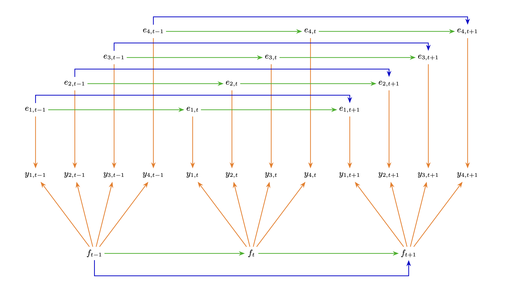

```{r libraries, echo=FALSE}
### LIBRARIES ###

library("tidyverse")
library("readxl")
library("tidyquant")
library("psych")
library("ggcorrplot")
library("knitr")
library("kableExtra")
library("patchwork")
library("showtext")
showtext_auto()
```

```{r}
#| label: setup
#| include: false

library(ggplot2)

# This changes the default theme and font for ALL plots that follow
theme_set(
  theme_minimal(base_family = "serif") # Use "serif" if Charter throws an error
)
```

\newpage

# Abstract {.unnumbered}

In a 1988 working paper, Stock and Watson proposed a framework to estimate and forecast short-run U.S. economic activity. Their model built on the premise that co-movements across multiple macroeconomic variables can be captured by a single, unobserved latent variable. Specifically, they hypothesized that their four chosen indicators form a dynamic single-factor model in which the latent factor represents the state of the business cycle and can therefore be mapped to Gross Domestic Product (GDP) growth @S&W1988.

This project empirically tests the Kalman filter under two different forms of misspecification, departing from the original Stock and Watson assumptions. We begin in @sec-one by replicating the model on more recent data to establish a performance benchmark, confirming that the original model yields a latent factor that continues to track GDP growth well, with an $R^2$ of $0.763$ and MSE of $0.276$.

Next, in @sec-two we assess the robustness of the Kalman filter to violation of the Gaussianity assumption. Since macroeconomic data frequently exhibits heavy tailed and asymmetric behaviors, we simulate economies under progressively more elliptical and skewed distributions. We find that convergence to the true latent factor is faster under Gaussian errors and slows as distributions become more elliptical or skewed. However, the Kalman filter continues to recover the true factor in large samples across all specifications.

Finally, in @sec-three we expand the number of indicators, including price-side variables and therefore introducing a second latent factor into the data-generating process. Estimating a single-factor model on this augmented dataset, we find that the Kalman filter recovers only the real-activity factor, assigning loadings close to zero to all price indicators. After re-estimating the model under the correct two-factor specification, the Kalman filter successfully recovers both the real-activity factor and price-pressure factor, yielding an $R^2$ of $0.761$ against GDP growth and $0.732$ against PCEPI inflation.

\newpage

# The Stock and Watson model {#sec-one}

We first replicate the model proposed by Stock and Watson. Their model assumes that the co-movements of four macroeconomic indicators are driven by a single, unobserved latent factor which represents the overall business cycle. The included indicators are:

-   IPMAN (Industrial Production: Manufacturing).
-   CMRMTSPL (Real Manufacturing and Trade Industries Sales).
-   PAYEMS (Total Nonfarm Payrolls).
-   W875RX1 (Real Personal Income Excluding Current Transfer Receipts).

These series are FRED equivalents of the original Stock and Watson indicators, following the implementation of Fulton (2015) as part of the *statsmodels* library [@seabold2010]. Indeed, each series captures the same underlying dimension of real economic activity as the original indicators included in the Stock and Watson paper: industrial output (*INDPRO*), goods and services demand (*CMRMTSPL*), labor market conditions (*PAYEMS*), and household earned income (*W875RX1*). Therefore, results should be interpreted as a conceptual replication rather than a numerical one, and differences in estimated loadings are mostly attributable to the series substitutions. 

To capture the cyclic pattern of business cycles, both the factor and the error follow an $AR(2)$ process. Visually, the model can be represented by the graphical model represented in @fig-SW.

```{r}
#| label: fig-SW
#| fig-cap: "Stock & Watson dynamic factor model [@S&W1988]."
#| out-width: "100%"
#| fig-align: "center"
#| echo: false


```

Formally, the model is represented by the following structural equations:

-   The measurement equation: $y_t = \lambda f_{t} + e_{t}$
-   The factor transition equation: $f_{t} = \phi_{1}f_{t-1} + \phi_{2}f_{t-2} + w_{t}, \quad w_{t} \overset{\mathrm{i.i.d.}}{\sim} \mathcal{N}(0,1)$
-   The error transition equation: $e_{t} = \psi_{1}e_{t-1} + \psi_{2}e_{t-2} + \epsilon_{t}, \quad \epsilon_{t} \overset{\mathrm{i.i.d.}}{\sim} \mathcal{N}(0, \sigma_{i}^{2})$

Where:

-   $y_t$ is the $(4 \times 1)$ vector of normalized log-differences of the indicators at time $t$
-   $\lambda$ is the $(4 \times 1)$ vector of coefficients
-   $f_t$ is the $(1 \times 1)$ factor scalar at time $t$
-   $e_t$ is the $(4 \times 1)$ vector of errors at time $t$

Notice that this model assumes two conditional independence statements. First, the four indicators are cross-sectionally conditionally independent given the latent factor, meaning that once the common factor is known, knowing one indicator provides no additional information about the others. Formally:

$$y_{i,t} \perp\!\!\!\perp y_{j,t} \mid f_t \quad \forall\, i \neq j$$

Second, since both the factor and the errors follow an AR(2) process, given the state vector $h_t$ current indicators are conditionally independent of all future and past observations. Formally:

$$y_t \perp\!\!\!\perp y_s \mid h_{t} \quad \forall\ t \neq s$$

Where:

$$h_t = (f_t, f_{t-1}, e_{1,t}, e_{1,t-1}, \ldots, e_{n,t}, e_{n,t-1})$$

```{r kalman-system}
### SETUP ###

### MATRIX FUNCTION ###

matrices <- function(th, n, r, n_lam, h_dim, varQ) {

  # H MATRIX #
  
  # Factor loading block (leftside block)
  # Starting the block
  lambda <- matrix(0, n, 2*r)
  # Index for theta
  idx <- 1
  # Building the block
  for (j in 1:r) {
    # Number of free loadings
    nf <- n - j + 1
    # Filling odd columns with loadings
    lambda[j:n, (2*j - 1)] <- th[idx:(idx + nf - 1)]
    idx <- idx + nf
  }
  
  # (1 0) rightside block
  H_aux <- kronecker(diag(n), matrix(c(1, 0), nrow = 1))
                     
  # Final H matrix
  Hmat <- cbind(lambda, H_aux)

  # F MATRIX #
  
  # Calculating offset of parameters in the theta vector
  off_phi <- n_lam
  off_psi <- n_lam + (2*r) 
  
  # Starting the matrix
  Fmat <- matrix(0, h_dim, h_dim)

  # Factor rows (2 rows per factor, filling rows one by one)
  for (j in 1:r) {
    # Phi_1 entry (odd row, odd column)
    Fmat[(2*j - 1), (2*j - 1)] <- th[off_phi + 2*(j - 1) + 1]
    # Phi_2 entry (odd row, even column)
    Fmat[(2*j - 1), (2*j)] <- th[off_phi + 2*(j - 1) + 2]
    # 1 entry (even row, odd column)
    Fmat[(2*j), (2*j - 1)] <- 1 
  }

  # Idiosyncratic rows (2 rows per series)
  for (i in seq_len(n)) {
    # Psi_1 entry (odd row, odd column)
    Fmat[(2*r + 2*i - 1), (2*r + 2*i - 1)]  <- th[off_psi + 2*(i - 1) + 1]
    # Psi_2 entry (odd row, even column)
    Fmat[(2*r + 2*i - 1), (2*r + 2*i)] <- th[off_psi + 2*(i - 1) + 2]
    # 1 entry (even row, odd column)
    Fmat[(2*r + 2*i), (2*r + 2*i - 1)] <- 1
  }

  # R MATRIX #
  
  # R is an (n x n) matrix of zeroes
  Rmat <- matrix(0, n, n)
  
  # Q MATRIX #
  
  # Calculating offset of parameters in the theta vector
  off_sig <- n_lam + (2*r) + (2*n) 
  
  # Auxiliary vector of (VarQ 0) for each factor
  varQ_auxvec <- c(rep(c(varQ, 0), r))
  # Calculating the variance of each noise
  sigma2 <- th[(off_sig + 1):(off_sig + n)]^2
  # Auxiliary vector of (sigma2 0) for each error
  sigma2_auxvec <- as.vector(rbind(sigma2, 0))
  
  # Variance matrix
  Qmat <- diag(c(varQ_auxvec, sigma2_auxvec))

  # RETURNING LIST OF MATRICES #
  list(Hmat = Hmat, Fmat = Fmat, Rmat = Rmat, Qmat = Qmat)
}

### KALMAN FILTER FUNCTION ###

kalman <- function(th, y, n, r, TT, n_lam, h_dim, varQ) {
  
  # Pulling the matrices
  mats <- matrices(th, n, r, n_lam, h_dim, varQ)
  Hmat <- mats$Hmat  
  Fmat <- mats$Fmat
  Rmat <- mats$Rmat
  Qmat <- mats$Qmat
  
  # Initializing the vectors to store the likelihood and the factor estimate
  like       <- numeric(TT)
  filter_mat <- matrix(0, TT, h_dim)
  
  # Initial state vector (h_{0|0} = 0) and variance (P_{0|0} = I)
  h00        <- matrix(0, h_dim, 1)
  Pmat00     <- diag(h_dim)
  
  # Kalman filter loop
  for (it in seq_len(TT)) {
    # Step 1: prediction of ht given info at t-1
    h10      <- Fmat %*% h00
    # Step 2: prediction of Pt given info at t-1
    Pmat10   <- Fmat %*% Pmat00 %*% t(Fmat) + Qmat
    # Step 3: prediction of yt given info at t-1
    y10      <- Hmat %*% h10
    # Step 4: estimation of the forecast error
    e10      <- matrix(y[it, ], ncol = 1) - y10
    # Step 5: estimation of the variance of the forecast error
    Fmat10   <- Hmat %*% Pmat10 %*% t(Hmat) + Rmat
    # Log-Likelihood Calculation
    like[it] <- -0.5 * (n * log(2 * pi) + log(det(Fmat10)) +
                          drop(t(e10) %*% solve(Fmat10) %*% e10))
    # Step 6: Kalman gain
    Kmat     <- Pmat10 %*% t(Hmat) %*% solve(Fmat10)
    # Step 7: updating of filter and variance
    h11      <- h10 + Kmat %*% e10
    Pmat11   <- Pmat10 - Kmat %*% Hmat %*% Pmat10
    
    # Iterating
    filter_mat[it, ] <- t(h11)
    h00 <- h11
    Pmat00 <- Pmat11
  }
  
  # Returning loglikelihood and the extracted matrices
  list(neg_loglik = -sum(like), filter_mat = filter_mat, 
       Hmat = Hmat, Fmat = Fmat)
}

### STARTING VALUES FUNCTION ###

# Setting starting values (0.5 for lambdas, 0.3 for AR(2) coefficients)
make_startval <- function(y, n, r, n_lam) {
  lambda_init <- rep(0.5, n_lam) # lambdas
  ar_f_init   <- rep(0.3, 2*r)   # factor AR(2)
  ar_e_init   <- rep(0.3, 2*n)   # errors AR(2)
  sd_init     <- apply(y, 2, sd) # standard deviations
  c(lambda_init, ar_f_init, ar_e_init, sd_init)
}

### ESTIMATION FUNCTION ###

# y is the dataset, r is the number of factors, maxit is the number of
# iterations of the likelihood process
dfm <- function(data, r = 1, maxit = 2000) {
  
  # Standardizing the data
  y <- scale(data)
  
  # Dimensions of the dataset
  TT <- nrow(y)
  n  <- ncol(y)
  # Dimensions of the state vector and the number of parameters
  h_dim <- 2*r + 2*n
  n_lam <- r*n - r*(r - 1)/2
  # Variance normalization
  varQ <- 1
  
  # Starting values for the parameters
  th0 <- make_startval(y, n, r, n_lam)

  # Likelihood maxmization
  opt <- optim(
    par    = th0,
    fn     = function(th) kalman(th, y, n, r, TT, n_lam, 
                                 h_dim, varQ)$neg_loglik,
    method = "BFGS",
    hessian = TRUE,
    control = list(maxit = maxit, reltol = 1e-8)
  )
  th_hat <- opt$par
  
  # Standard errors estimates
  H      <- opt$hessian
  se_hat <- sqrt(diag(solve(H)))

  # Rerunning Kalman filter with optimal parameters to extract the factors
  kf_hat     <- kalman(th_hat, y, n, r, TT, n_lam, h_dim, varQ)
  factor_hat <- kf_hat$filter_mat[, 2*(1:r) - 1, drop = FALSE]
  
  # Auxiliary indexes
  idx_lam <- 1:n_lam
  idx_phi <- (n_lam + 1):(n_lam + 2*r)
  idx_psi <- (n_lam + 2*r + 1):(n_lam + 2*r + 2*n)
  idx_sig <- (n_lam + 2*r + 2*n + 1):(n_lam + 2*r + 2*n + n)
  
  # Returning everything as a named list
  list(
    convergence = opt$convergence,
    loglik      = -opt$value,
    factor      = factor_hat,
    lambda      = list(est = th_hat[idx_lam], se = se_hat[idx_lam]),
    phi         = list(est = th_hat[idx_phi], se = se_hat[idx_phi]),
    psi         = list(est = th_hat[idx_psi], se = se_hat[idx_psi]),
    sd          = list(est = th_hat[idx_sig], se = se_hat[idx_sig]),
    th_hat      = th_hat,
    se_hat      = se_hat
  )
}
```

## Latent factor estimation {#sec-kalman-filter}

Given that the model is linear and that shocks $w_t$ and $\epsilon_t$ are assumed to be Gaussian and independent, the optimal estimator for the latent factor is the Kalman filter [@kalman1960]. At each period $t$, the filter proceeds in two steps. In the prediction step, it forecasts the state vector $h_t$ from the previous estimate using the transition equation. In the update step, after observing $y_t$, it computes the prediction error and corrects the state estimate:

$$\hat{h}_{t|t} = \hat{h}_{t|t-1} + K_t\, e_{t|t-1}, \qquad 
K_t = P_{t|t-1}H^\top\!\left(HP_{t|t-1}H^\top + R\right)^{-1}$$

The Kalman gain $K_t$ shrinks when observations are noisy, causing the filter to rely more heavily on its own prediction, while it grows when observations are reliable, weighting more heavily the new data and therefore the prediction error. For a full derivation, see [@hamilton1994, Ch. 13].

The Kalman filter, however, requires the errors of the measurement equation $e_t$ to be independent white noise, unlike the $AR(2)$ specification of the Stock and Watson model. To overcome this limitation, we take the $AR(2)$ errors out of the measurement equation and include them into the latent state vector $h_{t}$, alongside the current and lagged values of the factor. With this structure, the $F$ matrix handles the $AR(2)$ dynamics of both the factor and the error and the model reduces to the following state-space system:

-   The measurement equation: $y_t = H h_{t}$
-   The factor transition equation: $h_{t} = Fh_{t-1} + v_{t}, \quad v_{t} \overset{\mathrm{i.i.d.}}{\sim} \mathcal{N}(0,\sigma)$

The vector of optimal parameters is estimated via Gaussian Maximum Likelihood, where:

$$\theta = [\lambda_1, \dots, \lambda_4, \phi_1, \phi_2, \psi_{11}, \dots \psi_{42}, \sigma_1^2, \dots, \sigma_4^2 ]'_{(18 \times 1)}$$

## Mapping the latent factor to GDP growth {#sec-mapping-factor}

After estimating the latent factor using the Kalman filter, we rescale it to make it interpretable in terms of actual economic activity. To do so, we regress GDP onto the estimated factor by Ordinary Least Squares (OLS). This allows us to plot the estimated latent factor against GDP growth and calculate in-sample performance metrics, such as the coefficient of determination ($R^2$) and the Mean Squared Error (MSE).

```{r data loading}
### LOADING DATA

# GDP
gdp_id <- "GDPC1"

# Real economy
real_ids <- c(
  "IPMAN",    # Industrial Production
  "CMRMTSPL", # Manufacturing & Trade Sales
  "PAYEMS",   # Nonfarm Payrolls
  "W875RX1"   # Real Personal Income less Transfers 
)

# All ids
ids <- c(gdp_id, real_ids)

# Defining path for local data cache (for rendering)
data_file <- "fred_macro_data.rds"

# Checking if data is already downloaded
if (file.exists(data_file)) {
  # If yes, load it locally (bypassing FRED API)
  raw_data <- read_rds(data_file)
} else {
  # If no, download from FRED and save it for future renders
  raw_data <- tq_get(ids, get = "economic.data",
                     from = "1972-04-01", to = "2025-01-01")
  write_rds(raw_data, data_file)
}

# Pivoting data in wide format
data_monthly <- raw_data %>%
  pivot_wider(names_from = symbol, 
              values_from = price) %>%
  arrange(date)

# Aligning the GDP measurement
df_aligned <- data_monthly %>%
  arrange(date) %>%
  mutate(GDPC1 = lag(GDPC1, 2))

# Applying log differences to obtain the final dataset
df_clean <- df_aligned %>%
  arrange(date) %>%
  mutate(
    # Log-difference for the monthly variables (lag = 1)
    across(all_of(c(real_ids)), 
           ~ (log(.x) - log(lag(.x, 1))) * 100),
    
    # Log-difference for the quarterly GDP (lag = 3)
    GDPC1 = (log(GDPC1) - log(lag(GDPC1, 3))) * 100
  ) %>%
  # Dropping the very first row since month-over-month lag creates an NA
  drop_na(PAYEMS)

# gdp data
gdp <- df_clean %>%
  select(GDPC1) %>%
  drop_na(GDPC1) %>%
  as.matrix()

# Matrix of indicators
y_raw <- df_clean %>%
  select(- date, - GDPC1) %>%
  as.matrix()
```

```{r gdp on factor OLS}
if (file.exists('results/stock_watson.RData')){
  load('results/stock_watson.RData')
} else{
  fit1 <- dfm(data = y_raw, r = 1, maxit = 2000)
  save(fit1, file = 'results/stock_watson.RData')
}
```

As shown in @fig-fit1, empirical results demonstrate the strong explanatory power of the model proposed by Stock and Watson. The mapped factor explains approximately 76% of the total variance of actual quarterly GDP growth ($R^2 = 0.763$ ). Moreover, the model yields an in-sample MSE of $0.276$, translating to a Root Mean Squared Error (RMSE) of roughly $0.526$ percentage points. This RMSE might seem elevated, but it is important to note that our dataset includes periods of extreme macroeconomic volatility, such as the 2008 and COVID-19 crises, which inflate the error metrics.

```{r factor to GDP}
### MAPPING FACTOR TO GDP ###

factor <- fit1$factor[, 1]

TT <- nrow(y_raw)

# Converting from monthly to quarterly
factorQ <- (1/3) * factor[5:TT] +
  (2/3) * factor[4:(TT - 1)] +
  factor[3:(TT - 2)] +
  (2/3) * factor[2:(TT - 3)] +
  (1/3) * factor[1:(TT - 4)]

# Downsampling
i <- 1
factgdp <- c()
while (i < (TT - 4)) {
  factgdp <- c(factgdp, factorQ[i])
  i <- i + 3
}

# Defining the data
y_gdp <- gdp

# Creating the X matrix with a column of 1s for the intercept
x <- cbind(1, factgdp)

# Computing the OLS coefficients
b <- solve(t(x) %*% x) %*% t(x) %*% y_gdp

### IN-SAMPLE ESTIMATES OF GDP AND PERFORMANCE MEASURES ###

# Translating all historical factors into estimated GDP 
gdp_fitted <- x %*% b

# Calculating the residuals
residuals <- y_gdp - gdp_fitted

# Calculating Mean Squared Error (MSE)
mse <- mean(residuals^2)

# Calculating R-squared
ss_tot <- sum((y_gdp - mean(y_gdp))^2)
ss_res <- sum(residuals^2)
r_squared <- 1 - (ss_res / ss_tot)
```

```{r plot s_w, echo=FALSE}
#| label: fig-fit1
#| fig-cap: "Fitted vs. actual GDP quarterly growth, original Stock and Watson model."

### PLOTTING ###

# Combining the data into a tibble
plot_data <- tibble(
  Index = 1:length(y_gdp),
  Actual = as.vector(y_gdp),
  Fitted = as.vector(gdp_fitted)
) %>%
  # Pivot to long format for ggplot2
  pivot_longer(cols = c(Actual, Fitted), names_to = "Series", values_to = "Value")

# Generating the plot
ggplot(plot_data, aes(x = Index, y = Value, color = Series)) +
  geom_line(linewidth = 0.5) +
  
  # Setting colors
  scale_color_manual(values = c("Actual" = "dodgerblue3", "Fitted" = "red3")) +
  
  # Adding titles and labels
  labs(
    title = "Actual vs. fitted quarterly GDP percentage growth",
    subtitle = sprintf("Performance metrics (in-sample): R-squared = %.3f; MSE = %.3f", 
                       as.numeric(r_squared), as.numeric(mse)),
    x = "Time", 
    y = "Quarterly GDP growth (%)",
    color = NULL
  ) +
  
  # Applying a cleaner theme
  theme_minimal(base_family = "charter") +
  theme(
    legend.position  = "bottom",
    plot.title       = element_text(face = "bold", size = 12, hjust = 0.5),
    plot.subtitle    = element_text(size = 11, hjust = 0.5),
    axis.title       = element_text(size = 9),
    axis.text        = element_text(size = 8)
  )
```

```{r save fit1, eval=FALSE, echo=FALSE}
# save plot image
ggsave(filename = "images/fit1.png",
       width=8, height=5, dpi=300)
```

As reported in @tbl-fit1-estimates, all four indicators load positively on the estimated factor, in decreasing order of magnitude: *IPMAN* ($\hat{\lambda} = 0.926$), *PAYEMS* ($\hat{\lambda} = 0.782$), *CMRMTSPL* ($\hat{\lambda} = 0.711$), and *W875RX1* ($\hat{\lambda} = 0.525$). The results are consistent with the original S&W estimates, where all indicators had positive loading and industrial production also carried the largest loading ($0.717$) [@S&W1988].

```{r}
#| label: tbl-fit1-estimates
#| tbl-cap: "Maximum likelihood estimates of the Stock and Watson model"
#| tbl-pos: "H"

# Building the table
psi <- fit1$psi$est
psi_se <- fit1$psi$se
sd_vals <- fit1$sd$est^2
sd_se <- 2 * fit1$sd$est * fit1$sd$se

fmt <- function(x, s) paste0(sprintf("%.3f", x), " (", sprintf("%.3f", s), ")")

sw_table <- data.frame(
  Parameter   = c("$\\lambda_i$", "$\\psi_{1i}$", "$\\psi_{2i}$", "$\\sigma_i^2$"),
  IPMAN      = c(fmt(fit1$lambda$est[1], fit1$lambda$se[1]),
                  fmt(psi[1], psi_se[1]),
                  fmt(psi[2], psi_se[2]),
                  fmt(sd_vals[1], sd_se[1])),
  CMRMTSPL    = c(fmt(fit1$lambda$est[2], fit1$lambda$se[2]),
                  fmt(psi[3], psi_se[3]),
                  fmt(psi[4], psi_se[4]),
                  fmt(sd_vals[2], sd_se[2])),
  PAYEMS      = c(fmt(fit1$lambda$est[3], fit1$lambda$se[3]),
                  fmt(psi[5], psi_se[5]),
                  fmt(psi[6], psi_se[6]),
                  fmt(sd_vals[3], sd_se[3])),
  W875RX1     = c(fmt(fit1$lambda$est[4], fit1$lambda$se[4]),
                  fmt(psi[7], psi_se[7]),
                  fmt(psi[8], psi_se[8]),
                  fmt(sd_vals[4], sd_se[4]))
)

knitr::kable(sw_table, 
             format    = "latex", 
             booktabs  = TRUE,   
             col.names = c("Parameter", "IPMAN", "CMRMTSPL", "PAYEMS", "W875RX1"),
             align     = c("l", "c", "c", "c", "c"),
             escape    = FALSE) %>%
  kableExtra::kable_styling(full_width = FALSE) %>% 
  kableExtra::add_header_above(c("Coincident Indicator" = 5)) %>%
  kableExtra::footnote(
    general           = "Standard errors in parentheses.",
    general_title     = "",
    footnote_as_chunk = TRUE
  )
```

\newpage

# Breaking Gaussianity {#sec-two}

The dynamic factor model proposed by Stock and Watson explicitly assumes that all structural shocks are purely Gaussian, which grants it the property of being the minimum mean square error (MMSE) estimator of the latent factor, as proven by @hamilton1994 [Section 13.2].[^mmse-proof] However, economic cycles frequently feature sudden and massive shocks (e.g. the COVID-19 crisis), hence macroeconomic indicators are rarely normally distributed. Instead, they tend to exhibit heavy-tailed behavior. As illustrated in the Quantile-Quantile (Q-Q) plot below (@fig-normality-check), the distribution of our indicators indeed deviates from normality, confirming the presence of fat tails.

[^mmse-proof]: This follows from the fact that the model is linear and that shocks $w_t$ and $\epsilon_t$ are assumed to be Gaussian and independent; the conditional expectation $\mathbb{E}[h_t | y_{1:t}]$ minimizes mean squared error among all measurable functions of $y_{1:t}$. See @hamilton1994 [Section 4.1] for a standard proof.

```{r QQ plots, echo=FALSE}
#| label: fig-normality-check
#| fig-cap: "Normality diagnostics for macro indicators."

### CHECKING NORMALITY ASSUMPTION ###

# Reshaping the data to long format
plot_data <- df_clean %>%
  select(IPMAN, CMRMTSPL, PAYEMS, W875RX1) %>%
  pivot_longer(cols = everything(), names_to = "Indicator", values_to = "Value") %>%
  group_by(Indicator) %>%
  # Standardize
  mutate(Value_Scaled = as.numeric(scale(Value))) %>% 
  ungroup()

## Q-Q Plots
ggplot(plot_data, aes(sample = Value_Scaled)) +
  stat_qq(color = "steelblue", alpha = 0.6) +
  stat_qq_line(color = "red3", linewidth = 0.7) +
  facet_wrap(~Indicator) +
  theme_minimal() +
  labs(title = "Q-Q plot",
       subtitle = "Indicators density vs. Gaussian density") +
  
  # Applying a cleaner theme
  theme_minimal(base_family = "charter") +
  theme(
    legend.position  = "bottom",
    plot.title       = element_text(face = "bold", size = 12, hjust = 0.5),
    plot.subtitle    = element_text(size = 11, hjust = 0.5),
    axis.title       = element_text(size = 9),
    axis.text        = element_text(size = 8)
  )
```

```{r density plot, echo=FALSE}
# ## density plot
# p_density <- ggplot(plot_data, aes(x = Value_Scaled)) +
#   # empirical density
#   geom_density(aes(color = "Data", 
#                    fill =  "Data"), 
#                alpha = 0.2, linewidth = 0.8) +
#   # normal Distribution
#   stat_function(fun = dnorm, args = list(mean = 0, sd = 1),
#                 aes(color = "Normal"), 
#                 linetype = "dashed", 
#                 linewidth = 1) +
#   
#   # student-t Distribution 
#   stat_function(fun = dt, args = list(df = 3),
#                 aes(color = "Student-t"), 
#                 linetype = "dotted", 
#                 linewidth = 1) +
#   
#   facet_wrap(~ Indicator, scales = "free") +
#   xlim(-5, 5) +
#   scale_color_manual(name = "Distributions",
#                      values = c("Data" = "black",
#                                 "Normal" = "blue",
#                                 "Student-t" = "red")) +
#   scale_fill_manual(name = "Distributions", 
#                     values = c("Data" = "gray50", 
#                                "Normal" = NA, 
#                                "Student-t" = NA)) +
#   labs(title = "Density of macro indicators",
#        x = "Standardized log-difference",
#        y = "Density") +
#   theme_minimal(base_family = "charter") +
#   guides(fill = "none")
#   theme(
#     legend.position  = "bottom",
#     plot.title       = element_text(face = "bold", size = 11, hjust = 0.5),
#     plot.subtitle    = element_text(size = 10, hjust = 0.5),
#     axis.title       = element_text(size = 8),
#     axis.text        = element_text(size = 7)
#   )
```

```{r normality plots tg, echo=FALSE}
# p_qq + p_density & theme(text = element_text(family = "charter"))
```

Despite the violation of the normality assumption, the Kalman filter extracts a consistent estimate of the latent factor. Indeed, when the parameters are estimated via Gaussian quasi-maximum likelihood, consistency of the parameter estimates is preserved under non-Gaussianity, though with loss of efficiency in finite samples as the distribution moves away from Gaussianity and gets increasingly elliptical [@white1982]. 

The reason for this is that under a misspecified likelihood, the Kalman gain is no longer optimal; therefore, the filter requires more observations to achieve the same precision as it would under correctly specified Gaussian shocks. This efficiency loss is particularly relevant for macroeconomic data, which, with fewer than 700 observations, can never be confidently characterized as truly Gaussian, and empirically exhibits heavy-tailed behavior consistent with a student-t distribution as shown in *Table 1* of [@geweke1993].[^geweke] We evaluate this by simulating the S&W data generating process under three distributional assumptions of increasing complexity: Gaussian, student-t, and skew-t, the latter of which introduces nonzero skewness via a slant parameter $\alpha \neq 0$.

[^geweke]: @geweke1993 specifically tests on fourteen macroeconomic indicators including Industrial Production, Employment, and Real GNP, finding overwhelmingly positive evidence against normality at decreasing degrees of freedom ($\nu = 20, 10, 5, 3, 1$), in favor of student-t errors at low-to-moderate degrees of freedom. This motivates our decision to use student-t and naturally skew-t as distributional assumptions away from normality, with our degrees of freedom chosen as $\nu = 5$ in the simulations.

To better understand this phenomenon, we generate synthetic data based on our coefficient estimates derived from @sec-mapping-factor that increasingly diverge from normality. We first understand the behavior of the efficient parameters derived under Gaussian distribution in @sec-gaussian-dist, after which we move into a typical finite-sample distribution of student-t in @sec-student-t-dist, and finally we explore more complex distributions such as skew-t with varying degrees of skew in @sec-skew-t-dist to understand where exactly the filter breaks down.

## Gaussian distribution {#sec-gaussian-dist}

To simulate Gaussian data into our Kalman filter, we generate a structured array of various sample sizes to evaluate how the estimator performs in finite samples and what happens to its performance as $T \rightarrow \infty$.

For each sample size, we generate a true latent factor following an AR(2) process with coefficient values of $\hat{\phi}_1 = 0.240$  and $\hat{\phi}_2 = -0.073$, estimated from the S&W model in @sec-kalman-filter, with Gaussian shocks by assumption. We then construct the observable data by multiplying the true factor by the estimated factor loadings from @sec-kalman-filter and adding normally distributed idiosyncratic errors, replicating the structure of the S&W measurement equation. The simulated observables are normalized and fed into the Kalman filter, and the correlation between the estimated factor $\hat{f}_t$ and the true factor $f_t$ is recorded across all sample sizes.

```{r gaussian function}
run_gaussian <- function(tt){
  
# 0. define factor coefficients
phi1 <- fit1$phi$est[1]
phi2 <- fit1$phi$est[2]

# factor loadings extracted from S&W 
lambda <- fit1$lambda$est

# 1. generate fake factor
f_true <- numeric(tt)

for (t in 3:tt) # factor follows an AR(2) w/ Gaussian errors
  f_true[t] <- phi1*f_true[t-1] + phi2*f_true[t-2] + rnorm(1)

# generate 'observables' of 4 series using estimated loadings from S&W
Y_normal <- f_true %*% t(lambda) + matrix(rnorm(tt*4), tt, 4)

# normalize
Y_normal <- scale(Y_normal)

# run kalman
final_sim <- kalman(th = fit1$th_hat, y = Y_normal, 
                    n = 4, r = 1, TT = tt, varQ = 1, 
                    n_lam = 4, 10)

f_hat <- final_sim$filter_mat[, 1]

cor(f_hat, f_true)
}
```

We first run a single iteration across sample sizes generated from `seq(10, 10000, by = 50)`, such that the lower bound captures realistic finite sample sizes representative of macroeconomic datasets, while the upper bound approaches the asymptotic nature of a dataset, where the property of consistency is expected to hold.

We see from @fig-gaussian that factor recovery under Gaussian shocks is stable across all sample sizes, with correlation between the estimated and true factor converging to approximately $0.7787$ as $T$ grows. The relatively high recovery even at small sample sizes is consistent with the Kalman filter being the minimum variance estimator under correctly specified Gaussian shocks, confirming that no efficiency loss is present when the distributional assumption holds.

```{r gaussian test run, eval=FALSE}
# one iteration
TT <- seq(10, 10000, by = 50)
results1 <- data.frame(
  sample_size = TT,
  Gaussian = sapply(TT, function(tt) run_gaussian(tt))
)
```

```{r save gaussian, echo=FALSE, eval=FALSE}
# save sim results
save(results1, file = "results/gaussian_results.RData")
```

```{r gaussian plotting data, echo=FALSE}
# load in data
load(file = "results/gaussian_results.RData")

# pivot to long format for plotting
results_long1 <- results1 %>%
  pivot_longer(cols = c(Gaussian), 
               names_to = "Distribution", 
               values_to = "Correlation")
```

```{r compute convergence value, echo=FALSE, eval=FALSE}
# CHECK: what is the value converging to asymptotically?
asymptotic_cor <- mean(replicate(50, run_gaussian(50000)))
saveRDS(object = asymptotic_cor, 
        file = "results/asymptotic_cor")
```

```{r load in convergence value, echo=FALSE}
# load in value to reference in-line w/ text
asymptotic_cor <- round(readRDS(file = 'results/asymptotic_cor'),4)
```

```{r gaussian plot, echo=FALSE}
#| label: fig-gaussian
#| fig-cap: "Factor recovery vs sample size under Gaussian shocks."

ggplot(results_long1, aes(x = sample_size, 
                          y = Correlation, 
                          color = Distribution)) +
  geom_line(linewidth = 0.8) +
  annotate("segment", 
           x = 0, xend= 10100,
           y = asymptotic_cor, yend = asymptotic_cor,
           linetype = "dashed", color = "black", linewidth = 0.5) +
  scale_y_continuous(limits = c(0.70, 0.85))+
  scale_color_manual(values = c("Gaussian" = "dodgerblue3")) +
  labs(title = "Factor recovery vs sample size",
       subtitle = "Gaussian shocks",
       x = "Sample size", y = "Mean correlation", color = NULL,
       caption = paste("Dashed line indicates asymptotic factor recovery:",
                       asymptotic_cor)) +
  theme_minimal(base_family = "charter") +
  theme(
    legend.position  = "bottom",
    plot.title       = element_text(face = "bold", size = 12, hjust = 0.5),
    plot.subtitle    = element_text(size = 11, hjust = 0.5),
    plot.caption     = element_text(hjust=0.5),
    axis.title       = element_text(size = 9),
    axis.text        = element_text(size = 8)
  )
```

```{r save gaussian plot, eval=FALSE, echo=FALSE}
# save plot image
ggsave(filename = "images/gaussian_plot.png",
       width=8, height=5, dpi=300)
```

## Student-t distribution {#sec-student-t-dist}

To break the assumption of Gaussianity, we simulate the S&W data generating process under a student-t distribution, which is well documented as a realistic characterization of finite sample macroeconomic data [@geweke1993].

Theoretically, given the QMLE consistency property, we should expect the Kalman filter to remain consistent in its recovery of the latent factor, meaning the estimates converge to the true factor as $T \rightarrow \infty$. However, we expect to observe an efficiency loss in finite samples, as the Kalman gain is derived under the Gaussian likelihood and is therefore suboptimal when the true distribution has heavier tails [@white1982; @DurbinKoopman2012]. Here we select the degrees of freedom to be $\nu = 5$, as supported by empirical results from *Table 1* in [@geweke1993], as the posterior odds ratio strongly support student-t distribution at this level. Lower values of $\nu$ would generate extreme draws too frequently to match the empirical behavior of macroeconomic data, where shocks like the COVID-19 disruption are severe but rare. The choice $\nu = 5$ is also the lowest degree of freedom at which both the variance and kurtosis of the student-t distribution remain finite, satisfying the regularity conditions required for QMLE consistency (i.e. finite fourth moments and non-zero variance; see *Theorem 3.3* in [@white1982]).

As illustrated in @fig-student-t, the Kalman filter remains consistent under student-t shocks, with factor recovery converging to approximately $0.7787$ as $T \rightarrow \infty$, in line with the Gaussian baseline from @sec-gaussian-dist. However, the trajectory is notably more volatile across sample sizes, particularly in the finite sample realm where the correlation fluctuates significantly before stabilizing. This is consistent with the theoretical prediction that the Kalman filter loses efficiency under heavy-tailed distributions, as the misspecified Gaussian likelihood produces a suboptimal Kalman gain that requires more observations to average out the influence of extreme draws.

```{r student_t function, echo=FALSE}
run_student_t <- function(tt){
  
# 0. define factor coefficients
phi1 <- fit1$phi$est[1]
phi2 <- fit1$phi$est[2]
  
# 0. factor loadings extracted from S&W
lambda <- fit1$lambda$est
  
# 1. generate fake factor
f_true <- numeric(tt)
for (t in 3:tt)
  f_true[t] <- phi1*f_true[t-1] + phi2*f_true[t-2] + rt(1, df=5)/sqrt(5/3)

# force observables through 4 series using estimated loadings
Y_normal <- f_true %*% t(lambda) + matrix(rt(tt*4, df=5) / sqrt(5/3),
                                          tt, 4)

# normalize
Y_normal <- scale(Y_normal)

# run kalman
final_sim <- kalman(th = fit1$th_hat, y = Y_normal, n = 4, 
                    r = 1, TT = nrow(Y_normal), varQ = 1, 
                    n_lam = 4, 10)
f_hat <- final_sim$filter_mat[, 1]

# results
cor(f_hat, f_true)
}
```

```{r student_t test run, eval=FALSE}
# one iteration
TT <- seq(10, 10000, by = 50)
results2 <- data.frame(
  sample_size = TT,
  Student_t = sapply(TT, function(tt) run_student_t(tt))
)
```

```{r save student t, echo=FALSE, eval=FALSE}
# save sim results
save(results2, file = "results/student_t_results.RData")
```

```{r student_t plotting data, echo=FALSE}
# load in data
load(file = "results/student_t_results.RData")

# format data to long for plotting
results_long2 <- results2 %>%
  pivot_longer(cols = c(Student_t), 
               names_to = "Distribution", 
               values_to = "Correlation")
```

```{r student_t plot, echo=FALSE}
#| label: fig-student-t
#| fig-cap: "Factor recovery vs sample size under Student-t shocks."

# plot
ggplot(results_long2, aes(x = sample_size, 
                          y = Correlation, 
                          color = Distribution)) +
  geom_line(linewidth = 0.8) +
  annotate("segment", 
           x = 0, xend= 10100,
           y = asymptotic_cor, yend = asymptotic_cor,
           linetype = "dashed", color = "black", linewidth = 0.5) +
  scale_color_manual(values = c("Student_t" = "salmon")) +
  scale_y_continuous(limits = c(0.7,0.85)) +
  labs(title = "Factor recovery vs sample size",
       subtitle = "Student-t, 5 degrees of freedom",
       x = "Sample size", y = "Mean correlation", color = NULL,
       caption = paste("Dashed line indicates asymptotic factor recovery:",
                       asymptotic_cor)) +
  theme_minimal(base_family = "charter") +
  theme(
    legend.position  = "bottom",
    plot.title       = element_text(face = "bold", size = 12, hjust = 0.5),
    plot.subtitle    = element_text(size = 11, hjust = 0.5),
    plot.caption     = element_text(hjust=0.5),
    axis.title       = element_text(size = 9),
    axis.text        = element_text(size = 8)
  )
```

```{r save student-t plot, eval=FALSE, echo=FALSE}
# save plot image
ggsave(filename = "images/student_t_plot.png",
       width=8, height=5, dpi=300)
```

In other words, the fat tails of the student-t distribution introduce large idiosyncratic shocks that the filter struggles to separate from the common factor signal at small $T$, resulting in noisier factor recovery relative to the Gaussian case. Despite this finite-sample volatility, the asymptotic recovery converges to the same value as the Gaussian baseline, confirming that the QMLE consistency property holds even under substantial deviations from normality.

## Skew-t distribution {#sec-skew-t-dist}

For a more complex distributional assumption, we simulate the S&W data generating process under a skew-t distribution, which extends the student-t by introducing asymmetry via a nonzero slant parameter $\alpha \neq 0$.

Specifically, we set $\alpha = 5$ which induces a positive skew, meaning the distribution has a longer right tail relative to the symmetric student-t case. Note that our simulated factor shocks are generated as follows:

`factor_shocks <- rst(tt, xi=0, omega=1, alpha=5, nu=5)`

`factor_shocks <- factor_shocks - mean(factor_shocks)`

The factor shocks are recentered by subtracting the sample mean, as the skew-t distribution has a nonzero mean when $\alpha \neq 0$, which would otherwise violate the zero mean assumption of the Kalman filter and introduce a systematic bias into the factor estimates.

Indeed, from our results in @fig-skew-t we see that the Kalman filter remains consistent under skew-t shocks, with factor recovery converging to approximately $0.7787$ as $T \rightarrow \infty$, in line with both the Gaussian and student-t baselines. This confirms the QMLE consistency result, as the estimator recovers the true latent factor regardless of the distributional assumption placed on the shocks.

```{r skew_t function, echo=FALSE}
library(sn)

run_skew_t <- function(tt, skew=5){
 
# 0. define factor coefficients
phi1 <- fit1$phi$est[1]
phi2 <- fit1$phi$est[2]
  
# 0. factor loadings extracted from S&W
lambda <- fit1$lambda$est
  
# 1. generate fake factor
factor_shocks <- rst(tt, xi=0, omega=1, alpha=skew, nu=5)
factor_shocks <- factor_shocks - mean(factor_shocks)

f_true <- numeric(tt)
for (t in 3:tt)
  f_true[t] <- phi1*f_true[t-1] + phi2*f_true[t-2] + factor_shocks[t]

# force observables through 4 series using your estimated loadings
shocks <- rst(tt*4, xi=0, omega=1, alpha=skew, nu=5)
shocks <- shocks - mean(shocks)

Y_normal <- f_true %*% t(lambda) + matrix(shocks, tt, 4)

# normalize
Y_normal <- scale(Y_normal)

# run kalman
final_sim <- kalman(th = fit1$th_hat, y = Y_normal, 
                    n = 4, r = 1, TT = nrow(Y_normal), 
                    varQ = 1, n_lam = 4, 10)
f_hat <- final_sim$filter_mat[, 1]

cor(f_hat, f_true)
}
```

```{r skew_t test run, eval=FALSE}
# one iteration
TT <- seq(10, 10000, by = 50)
results3 <- data.frame(
  sample_size = TT,
  Skew_t = sapply(TT, function(tt) run_skew_t(tt))
)
```

```{r save skew_t, echo=FALSE, eval=FALSE}
# save sim results
save(results3, file = "results/skew_t_results.RData")
```

```{r skew_t load plotting data, echo=FALSE}
# load in data
load(file = "results/skew_t_results.RData")

# check recovery
results_long3 <- results3 %>%
  pivot_longer(cols = c(Skew_t), 
               names_to = "Distribution", 
               values_to = "Correlation")
```

```{r skew_t plot, echo=FALSE}
#| label: fig-skew-t
#| fig-cap: "Factor recovery vs sample size under Skew-t shocks."

# plot skew_t
ggplot(results_long3, aes(x = sample_size, 
                          y = Correlation, 
                          color = Distribution)) +
  geom_line(linewidth = 0.8) +
  annotate("segment", 
           x = 0, xend= 10100,
           y = asymptotic_cor, yend = asymptotic_cor,
           linetype = "dashed", color = "black", linewidth = 0.5) +
  scale_y_continuous(limits = c(0.7,0.85)) +
  scale_color_manual(values = c("Skew_t" = "gold1")) +
  labs(title = "Factor recovery vs sample size",
       subtitle = "Skew-t, alpha 5",
       x = "Sample size", y = "Mean correlation", color = NULL,
       caption = paste("Dashed line indicates asymptotic factor recovery:",
                       asymptotic_cor)) +
  theme_minimal(base_family = "charter") +
  theme(
    legend.position  = "bottom",
    plot.title       = element_text(face = "bold", size = 12, hjust = 0.5),
    plot.subtitle    = element_text(size = 11, hjust = 0.5),
    plot.caption     = element_text(hjust=0.5),
    axis.title       = element_text(size = 9),
    axis.text        = element_text(size = 8)
  )
```

```{r save skew-t plot, eval=FALSE, echo=FALSE}
# save plot object
ggsave(filename= "images/skew_t_plot.png",
       width=8, height=5, dpi=300)
```

However, the trajectory is notably more volatile relative to both the Gaussian and student-t cases, with correlation fluctuating between $0.75$ and $0.80$ even at large sample sizes. This persistent volatility reflects the additional efficiency cost introduced by the nonzero skewness of the shock distribution, as the positive slant parameter $\alpha = 5$ generates asymmetric extreme draws that the Kalman filter, operating under a misspecified Gaussian likelihood, struggles to average out even at large $T$.

### Skew-t with increasing skewness {#sec-skew-t-increasing-skew}

The skew-t result with $\alpha = 5$ recovers the factor surprisingly well at a large sample size. An interesting extension would be to understand at exactly what skew parameter value does the skew-t become too extreme to consistently recover the factor. To explore this, we again run our simulation on skew-t generated data, this time with increasing, positive skew values: $\alpha = 1, 3, 5, 10, 20, 50$. We conduct a single iteration of the MC simulation for our array of values spanning from $n=10, \dots, 10000$.

From our results in @fig-skew-alpha-results, we see that even at extreme skews of $\alpha=50$ the asymptotic factor recovery is essentially invariant to the choice of skewness parameter.The volatility of the convergence in finite samples is similarly comparable across alpha values, with no clear monotonic relationship between skewness and convergence speed. This confirms the QMLE consistency property in its strongest form, wherein the Kalman filter recovers the latent factor regardless of the magnitude of the skewness in the shock distribution (provided the regularity conditions on finite moments hold, which they do for $\nu = 5$).

```{r skew-t increasing alphas interactive charts}
library(plotly)

x <- seq(-5, 10, length.out = 1000)

# Vary alpha
alphas <- c(0, 1, 3, 5, 10, 20, 50)
df <- do.call(rbind, lapply(alphas, function(a) {
  data.frame(x = x, 
             density = dst(x, xi = 0, omega = 1, alpha = a, nu = 5),
             alpha = factor(a))
}))

p1 <- ggplot(df, aes(x = x, y = density, color = alpha)) +
  geom_line(linewidth = 0.8) +
  labs(title = "Skew-t density for varying alphas",
       x = "x", y = "density", color = "alpha") +
  guides(color = guide_legend(title = NULL)) +
  theme_minimal(base_family = "charter") +
  theme(
    legend.position  = "bottom",
    plot.title       = element_text(face = "bold", size = 11, hjust = 0.5),
    plot.subtitle    = element_text(size = 10, hjust = 0.5),
    axis.title       = element_text(size = 8),
    axis.text        = element_text(size = 7)
  )
```


```{r skew-t increasing alphas sim, eval=FALSE}
# one iteration
alphas <- c(1, 3, 5, 10, 20, 50)

TT <- seq(10, 10000, by = 50)

results_extra <- expand.grid(sample_size = TT, alpha = alphas) %>% 
  mutate(Correlation = mapply(run_skew_t, sample_size, alpha))
```

```{r save skew t alphas, echo=FALSE, eval=FALSE}
# save sim results
save(results_extra, file = "results/skew_t_alphas_results.RData")
```

```{r skew-t alphas plotting data, echo=FALSE}
# load in data
load(file = "results/skew_t_alphas_results.RData")
```


```{r plot skew-t alpha sim results,echo=FALSE}
# plot skew-t increasing alpha sim results
p2 <- ggplot(results_extra, aes(x = sample_size, 
                          y = Correlation, 
                          color = factor(alpha))) +
  geom_line(linewidth = 0.5) +
  annotate("segment", 
           x = 0, xend= 10100,
           y = asymptotic_cor, yend = asymptotic_cor,
           linetype = "dashed", color = "black", linewidth = 0.5) +
  labs(title = "Factor recovery",
       x = "Sample size", y = "Correlation") +
  guides(color = guide_legend(title = NULL)) +
  theme_minimal(base_family = "charter") +
  ylim(0.6,1.0) +
  theme(
    legend.position  = "bottom",
    plot.title       = element_text(face = "bold", size = 11, hjust = 0.5),
    plot.subtitle    = element_text(size = 10, hjust = 0.5),
    axis.title       = element_text(size = 8),
    axis.text        = element_text(size = 7)
  )
```

```{r}
#| label: fig-skew-alpha-results
#| fig-cap: "Skew-t distributions across varying alphas."

p1 + p2 & theme(text = element_text(family = "charter"))
```

This implies that the direction of distributional misspecification matters less than its presence. Whether the shocks are symmetric heavy-tailed (student-t, @sec-student-t-dist) or asymmetric heavy-tailed (skew-t at any level of $\alpha$), the asymptotic recovery is preserved for the Stock and Watson dynamic factor model. The cost of misspecification is paid in finite sample volatility, not in the limit.

## Monte Carlo simulation and efficiency loss under non-Gaussian data

As illustrated in @fig-mc-results, the three distributions converge to the same asymptotic factor recovery correlation of approximately $0.7787$ as $T \rightarrow \infty$, directly confirming the QMLE consistency result. At small sample sizes, all three distributions exhibit greater volatility and slightly lower recovery, with the skew-t and student-t lines deviating more from the Gaussian baseline, consistent with the theoretical prediction of finite sample efficiency loss under non-Gaussianity.

Notably, both the student-t and skew-t distributions exhibit greater volatility relative to the Gaussian baseline, particularly at small sample sizes, with the skew-t remaining the most volatile throughout. It should be noted that the y-axis range is intentionally narrow to highlight these differences, and as reported in @tbl-variance, the absolute magnitude of the fluctuations is small in practice, with standard deviations of $0.0254$ and $0.0304$ for the student-t and skew-t, respectively. Nevertheless, all three distributions converge to the same asymptotic recovery value of $0.7787$, confirming the QMLE consistency result regardless of the distributional assumption.

```{r mc sim, eval=FALSE}
####################################################################
## DO NOT RUN! Will take hours to complete, objects already saved ##
####################################################################

# run simulation 50 times, take the average 
TT <- seq(10, 10000, by = 50)

# gaussian
results1 <- data.frame(
  sample_size = TT,
  Gaussian = sapply(TT, function(tt) mean(replicate(50, run_gaussian(tt))))
)

# student-t
results2 <- data.frame(
  sample_size = TT,
  Student_t = sapply(TT, function(tt) mean(replicate(50, run_student_t(tt))))
)

# skew-t
results3 <- data.frame(
  sample_size = TT,
  Skew_t = sapply(TT, function(tt) mean(replicate(50, run_skew_t(tt))))
)

save(results1, results2, results3, file = "results/mc_results.RData")
```

```{r load mc plotting data, echo=FALSE}
# load 50 MC sim results
load("results/mc_results.RData")

# join dfs and reformat for plotting
results_all <- inner_join(results1, results2, by = "sample_size") %>% 
  inner_join(., results3, by = "sample_size")

results_long_all <- results_all %>%
  pivot_longer(cols = c(Gaussian, Student_t, Skew_t), 
               names_to = "Distribution", 
               values_to = "Correlation")
```

```{r mc results plot, echo=FALSE}
#| label: fig-mc-results
#| fig-cap: "Factor recovery vs sample size, averaged across 50 MC simulations."
#| fig-pos: "H"

# all plotted tg
ggplot(data= results_long_all,
       aes(x = sample_size, 
           y = Correlation, 
           color = Distribution)) +
  annotate("segment", 
           x = 0, xend= 10100,
           y = asymptotic_cor, yend = asymptotic_cor,
           linetype = "dashed", color = "black", linewidth = 0.5) +
  geom_line(linewidth=0.5) +
  coord_cartesian(xlim = c(10, 10000), ylim = c(0.75, 0.80)) +
  scale_color_manual(values = c("Gaussian" = "dodgerblue2",
                                "Student_t" = "salmon",
                                "Skew_t" = "gold1")) +
  labs(title = "Factor recovery vs sample size",
       subtitle = "Mean correlation over 50 replications",
       x = "Sample size", y = "Mean correlation", color = NULL,
       caption = paste("Dashed black line indicates asymptotic factor recovery:",
                       asymptotic_cor)) +
  theme_minimal(base_family = "charter") +
  theme(
    legend.position  = "bottom",
    plot.title       = element_text(face = "bold", size = 12, hjust = 0.5),
    plot.subtitle    = element_text(size = 11, hjust = 0.5),
    plot.caption     = element_text(hjust=0.5),
    axis.title       = element_text(size = 9),
    axis.text        = element_text(size = 8)
  )
```

```{r save mc plot, echo=FALSE, eval=TRUE}
# save plot object
ggsave(filename = "images/mc_results_50_plot.png",
       width = 8, height = 5, dpi = 300)
```

To show the efficiency loss under non-Gaussian distributions, we run 200 replications of the Monte Carlo simulation at the empirical sample size of $T = 633$, corresponding to the number of observations in our FRED dataset, and compute the variance of factor recovery across replications.

As reported in @tbl-variance, the Gaussian estimator achieves the lowest variance of $0.000243$, confirming its optimality under correctly specified shocks. The student-t estimator exhibits a variance of $0.000644$, roughly three times that of the Gaussian case, while the skew-t estimator yields the highest variance of $0.000924$, approximately four times the Gaussian baseline. Importantly, the mean recovery is nearly identical across all three distributions at approximately $0.7787$, confirming that the estimator remains consistent regardless of the distributional assumption.

```{r variable table, eval=FALSE}
# run 200 replications, store all correlations
n_reps <- 200
TT_fixed <- 633  # actual sample size from FRED data

cors_gaussian <- replicate(n_reps, run_gaussian(TT_fixed))
cors_student  <- replicate(n_reps, run_student_t(TT_fixed))
cors_skewt    <- replicate(n_reps, run_skew_t(TT_fixed))

# variance of factor recovery across replications
var_table <- data.frame(
  Distribution = c("Gaussian", "Student-t", "Skew-t"),
  Mean         = c(mean(cors_gaussian), mean(cors_student), mean(cors_skewt)),
  Variance     = c(var(cors_gaussian),  var(cors_student),  var(cors_skewt)),
  SD           = c(sd(cors_gaussian),   sd(cors_student),   sd(cors_skewt))
)
```

```{r save variance table, echo=FALSE, eval=FALSE}
# save table
saveRDS(var_table, "results/var_table.rds")
```

```{r variance table results, echo=FALSE}
#| label: tbl-variance
#| tbl-cap: "Factor recovery: mean and variance across 200 replications."
#| tbl-pos: "H"

# load in table data
var_table <- readRDS("results/var_table.rds")

# kable
knitr::kable(var_table, 
             format   = "latex", 
             booktabs = TRUE,
             digits   = 6, 
             escape   = FALSE) %>% 
  kableExtra::kable_styling(full_width = FALSE)

```

Together, these results provide formal evidence of the consistency without efficiency property of the Gaussian quasi-maximum likelihood Kalman filter: the estimator converges to the correct value under all three distributions, but requires significantly more observations to do so with the same precision when shocks are non-Gaussian.

\newpage

# Two-factor model {#sec-three}

In this chapter we empirically examine how the Kalman filter behaves when the number of factors is misspecified. Specifically, we extend the original Stock and Watson framework by introducing four indicators from the price side of the economy, which are expected to share a second latent factor that tracks inflation rather than real activity. By mixing real and price indicators in a single-factor model, we deliberately misspecify the factor structure to illustrate what happens when variables are added blindly under the assumption that a larger dataset inherently yields a better fit.

## Parallel analysis to determine the number of factors {#sec-one-factor-specification}

Before estimating the extended model, we determine the number of factors in the original Stock and Watson model.

In nowcasting applications, the optimal number of factors is typically determined using the information criteria proposed by Bai and Ng @BaiNg2002, which minimize unexplained variance while applying a penalty for each additional factor. However, these criteria are derived for static factor models and is consistent only for $T,N \rightarrow \infty$, where $N$ is the number of variables and $T$ is the time dimension. Indeed, as Bai and Ng note: *"When* $min\{N, T\}$ *is 40 or larger, the proposed tests give precise estimates of the number of factors. Since our theory is based on large* $N$ *and large* $T$*, it is not surprising that for very small* $N$ *or* $T$*, the proposed criteria are inadequate."*

Given that our sample lacks the large cross-sectional dimension required by these criteria and given the underlying assumption of a dynamic factor model, we adopt an alternative approach to determine the appropriate number of factors. We therefore use parallel analysis, originally proposed by @Horn1965 to address a weakness of the Kaiser rule which retains factors with eigenvalues greater than one. Horn argues that in finite samples the eigenvalues of a covariance matrix computed from pure noise are not exactly equal to one because of sampling variation. Therefore, by keeping all factors that exceed the unit cutoff, one usually overestimates the number of factors. Parallel analysis corrects for this by comparing the eigenvalues of the observed data with those obtained from simulated noise data, retaining only factors with an associated eigenvalue larger than the one of the noise benchmark.

In the standard static application, the idiosyncratic component is simulated as white noise. To better adapt this to our dynamic application, we generate noise data from an AR(2) process using a Monte Carlo approach with 500 simulations. For each iteration, we use the same number of observations as our sample ($633$), applying the coefficients and variances derived from the Kalman filter estimates in @sec-mapping-factor. Finally, we average the eigenvalues across all 500 simulations to construct a noise benchmark that accurately takes into account the time-dependence structure of our data. 

The results of running parallel analysis on the original Stock and Watson model are displayed in @fig-parallel1. The first eigenvalue has a magnitude of $2.750$, well above the AR(2) noise benchmark of $1.090$, providing evidence of a dominant common factor driving the co-movements across the four real-activity indicators. All remaining eigenvalues fall below the noise benchmark, with the second one already dropping sharply to around $0.642$, well below the noise threshold. Overall, parallel analysis supports the one-factor assumption of the original Stock and Watson model, with the four indicators driven by a single latent factor representing the business cycle.

```{r parallel analysis single factor}
### PARALLEL ANALYSIS WITH AR(2) SIMULATION ###

TT <- nrow(y_raw)
n <- ncol(y_raw)

# COMPUTING THE EIGENVALUES OF THE FRED DATA

# Correlation matrix of the actual data
R_obs <- cor(y_raw)

# Extracting the eigenvalues
eig_obs <- eigen(R_obs)$values

# Extracting the estimated parameters
psi_hat    <- matrix(fit1$psi$est, nrow = n, ncol = 2, byrow = TRUE)
sigma2_hat <- fit1$sd$est^2

# AR(2) SIMULATION USING ONLY IDIOSYNCRATIC ERRORS

# Defining the AR(2) simulation function
ar2_null <- function(TT, n, psi, sigma2) {
  
  # Placeholder matrix
  U <- matrix(0, nrow = TT, ncol = n)
  
  # For loop to generate the errors with the estimated standard deviations
  for (i in 1:n) {
    eps <- rnorm(TT, sd = sqrt(sigma2[i]))
    
    # For loop to generate the matrix of the simulated indicators without the factor
    for (t in 3:TT) {
      U[t, i] <- psi[i, 1] * U[t-1, i] + psi[i, 2] * U[t-2, i] + eps[t]
    }
  }
  
  # Rescaling
  scale(U)
}

# MONTE CARLO SIMULATION

# Defining the number of simulations
n_sim <- 500

# Starting the matrix for the simulated eigenvalues (each row is the eigenvalues for one simulation)
eig_sim_mat <- matrix(NA, nrow = n_sim, ncol = n)

# Running the simulation
set.seed(42)
for (s in 1:n_sim) {
  y_sim <- ar2_null(TT, n, psi_hat, sigma2_hat)
  eig_sim_mat[s, ] <- eigen(cor(y_sim))$values
}

# Mean eigenvalues across simulations at each rank
eig_sim <- colMeans(eig_sim_mat)

# Printing the first 5 eigenvalues
n_print <- min(5, n)

eig_table <- data.frame(
  Index     = 1:n_print,
  Observed  = round(eig_obs[1:n_print], 3),
  Benchmark = round(eig_sim[1:n_print], 3)
)
```

```{r parallel analysis plotting single factor, echo=FALSE}
#| label: fig-parallel1
#| fig-cap: "Parallel analysis with AR(2) simulated noise, original Stock and Watson model."

# Plotting
plot_pa <- tibble(
  Index     = 1:n,
  Observed  = eig_obs,
  Benchmark = eig_sim
) %>%
  pivot_longer(cols = c(Observed, Benchmark), 
               names_to = "Series", values_to = "Eigenvalue")

ggplot(plot_pa, aes(x = Index, y = Eigenvalue, 
                    color = Series, linetype = Series, shape = Series)) +
  geom_line(linewidth = 0.8) +
  geom_point(size = 2) +
  scale_color_manual(values = c("Observed" = "steelblue", 
                                "Benchmark" = "red3")) +
  scale_linetype_manual(values = c("Observed" = "solid", 
                                   "Benchmark" = "solid")) +
  scale_shape_manual(values = c("Observed" = 16, "Benchmark" = 15)) +
  labs(
    title = "Observed vs. simulated eigenvalues, original Stock and Watson model",
    subtitle = "Parallel analysis with AR(2) errors",
    x = "Eigenvalue index", y = "Eigenvalue magnitude", color = NULL, 
    linetype = NULL, shape = NULL
  ) +
  theme_minimal(base_family = "charter") +
  theme(
    legend.position  = "bottom",
    plot.title       = element_text(face = "bold", size = 12, hjust = 0.5),
    plot.subtitle    = element_text(size = 11, hjust = 0.5),
    plot.caption     = element_text(hjust=0.5),
    axis.title       = element_text(size = 9),
    axis.text        = element_text(size = 8)
  )
```

```{r save parallel1 plot, eval=FALSE, echo=FALSE}
# save plot object
ggsave(filename = "images/parallel1_plot.png",
       width = 8, height = 5, dpi = 300)
```

## Introducing price-side indicators {#two-factor-specification}

We now extend the dataset by adding four indicators from the price side of the U.S. economy. The four price indicators we add are the following, all expressed in log-differences to reflect percentage changes:

-   CPIAUCSL (Consumer Price Index, all items).
-   CPILFESL (Consumer Price Index, all items less food and energy).
-   PCEPI (Personal Consumption Expenditures Price Index).
-   PPIACO (Producer Price Index, all commodities).

Among these, *PCEPI* also serves as the target variable to evaluate the estimated factor's mapping to inflation.

```{r loading two factor data}
### LOADING DATA

# FRED IDs

# GDP
gdp_id <- "GDPC1"

# Real economy
real_ids <- c(
  "IPMAN",    # Industrial Production
  "CMRMTSPL", # Manufacturing & Trade Sales
  "PAYEMS",   # Nonfarm Payrolls
  "W875RX1"   # Real Personal Income less Transfers 
)

# Prices
price_ids <- c(
  "CPIAUCSL", # CPI all items
  "CPILFESL", # Core CPI
  "PCEPI",    # PCE Price Index
  "PPIACO"    # PPI all commodities
)

# All ids
ids <- c(gdp_id, real_ids, price_ids)

# Defining path for local data cache (for rendering)
data_file <- "fred_macro_data2.rds"

# Checking if data is already downloaded
if (file.exists(data_file)) {
  # If yes, load it locally (bypassing FRED API)
  raw_data <- read_rds(data_file)
} else {
  # If no, download from FRED and save it for future renders
  raw_data <- tq_get(ids, get = "economic.data",
                     from = "1972-04-01", to = "2025-01-01")
  write_rds(raw_data, data_file)
}

# Pivoting data in wide format
data_monthly <- raw_data %>%
  pivot_wider(names_from = symbol, 
              values_from = price) %>%
  arrange(date)

# Aligning the GDP measurement
df_aligned <- data_monthly %>%
  arrange(date) %>%
  mutate(GDPC1 = lag(GDPC1, 2))

# Applying log differences to obtain the final dataset
df_clean <- df_aligned %>%
  arrange(date) %>%
  mutate(
    # Log-difference for the monthly variables (lag = 1)
    across(all_of(c(real_ids, price_ids)), 
           ~ (log(.x) - log(lag(.x, 1))) * 100),
    
    # Log-difference for the quarterly GDP (lag = 3)
    GDPC1 = (log(GDPC1) - log(lag(GDPC1, 3))) * 100
  ) %>%
  # Dropping the very first row since month-over-month lag creates an NA
  drop_na(PAYEMS)

### DEFINING THE DATA ###

# gdp data
gdp <- df_clean %>%
  select(GDPC1) %>%
  drop_na(GDPC1) %>%
  as.matrix()

# Inflation data
inflation <- df_clean %>%
  select(PCEPI) %>%
  drop_na(PCEPI) %>%
  as.matrix()

# Matrix of indicators
y_raw <- df_clean %>%
  select(- date, - GDPC1) %>%
  as.matrix()
```

```{r OLS on two-factor model}
if (file.exists("results/stock_watson_2.RData")){
  load("results/stock_watson_2.RData")
} else{
  fit2 <- dfm(data = y_raw, r = 1, maxit = 2000)
  save(fit2, file = "results/stock_watson_2.RData")
}
```

The result of running parallel analysis on the augmented dataset is shown in @fig-parallel2. Notably, both the first and the second observed eigenvalues exceed the AR(2) noise benchmark. The first eigenvalue is approximately $3.158$ (versus a benchmark of $1.197$), and the second is around $2.606$ (against $1.112$). All the other eigenvalues drop below the noise benchmark. Hence, this analysis suggests that the four indicators we have added to the dataset share a common latent factor that reflects price pressures in the economy, which is distinct from the real business cycle factor that drives the co-movements of the original four indicators.

```{r parallel analysis two factor}
### PARALLEL ANALYSIS WITH AR(2) SIMULATION ###

TT <- nrow(y_raw)
n <- ncol(y_raw)

# COMPUTING THE EIGENVALUES OF THE FRED DATA

# Correlation matrix of the actual data
R_obs <- cor(y_raw)

# Extracting the eigenvalues
eig_obs <- eigen(R_obs)$values

# Extracting the estimated parameters
psi_hat    <- matrix(fit2$psi$est, nrow = n, ncol = 2, byrow = TRUE)
sigma2_hat <- fit2$sd$est^2

# AR(2) SIMULATION USING ONLY IDIOSYNCRATIC ERRORS

# Defining the AR(2) simulation function
ar2_null <- function(TT, n, psi, sigma2) {
  
  # Placeholder matrix
  U <- matrix(0, nrow = TT, ncol = n)
  
  # For loop to generate the errors with the estimated standard deviations
  for (i in 1:n) {
    eps <- rnorm(TT, sd = sqrt(sigma2[i]))
    
    # For loop to generate the matrix of the simulated indicators without the factor
    for (t in 3:TT) {
      U[t, i] <- psi[i, 1] * U[t-1, i] + psi[i, 2] * U[t-2, i] + eps[t]
    }
  }
  
  # Rescaling
  scale(U)
}

# MONTE CARLO SIMULATION

# Defining the number of simulations
n_sim <- 500

# Starting the matrix for the simulated eigenvalues (each row is the eigenvalues for one simulation)
eig_sim_mat <- matrix(NA, nrow = n_sim, ncol = n)

# Running the simulation
set.seed(42)
for (s in 1:n_sim) {
  y_sim <- ar2_null(TT, n, psi_hat, sigma2_hat)
  eig_sim_mat[s, ] <- eigen(cor(y_sim))$values
}

# Mean eigenvalues across simulations at each rank
eig_sim <- colMeans(eig_sim_mat)

# Printing the first 5 eigenvalues
n_print <- min(5, n)

eig_table <- data.frame(
  Index     = 1:n_print,
  Observed  = round(eig_obs[1:n_print], 3),
  Benchmark = round(eig_sim[1:n_print], 3)
)
```

```{r parallel analysis two factor plot, echo=FALSE}
#| label: fig-parallel2
#| fig-cap: "Parallel analysis with AR(2) simulated noise, augmented model."

# Plotting
plot_pa <- tibble(
  Index     = 1:n,
  Observed  = eig_obs,
  Benchmark = eig_sim
) %>%
  pivot_longer(cols = c(Observed, Benchmark), 
               names_to = "Series", values_to = "Eigenvalue")

ggplot(plot_pa, aes(x = Index, y = Eigenvalue, 
                    color = Series, linetype = Series, shape = Series)) +
  geom_line(linewidth = 0.8) +
  geom_point(size = 2) +
  scale_color_manual(values = c("Observed" = "steelblue", 
                                "Benchmark" = "red3")) +
  scale_linetype_manual(values = c("Observed" = "solid", 
                                   "Benchmark" = "solid")) +
  scale_shape_manual(values = c("Observed" = 16, "Benchmark" = 15)) +
  labs(
    title = "Observed vs. simulated eigenvalues, augmented model",
    subtitle = "Parallel analysis with AR(2) errors",
    x = "Eigenvalue index", y = "Eigenvalue magnitude", color = NULL, 
    linetype = NULL, shape = NULL
  ) +
  theme_minimal(base_family = "charter") +
  theme(
    legend.position  = "bottom",
    plot.title       = element_text(face = "bold", size = 12, hjust = 0.5),
    plot.subtitle    = element_text(size = 11, hjust = 0.5),
    plot.caption     = element_text(hjust=0.5),
    axis.title       = element_text(size = 9),
    axis.text        = element_text(size = 8)
  )
```

```{r save parallel2 plot, eval=FALSE, echo=FALSE}
# save plot object
ggsave(filename = "images/parallel2_plot.png",
       width = 8, height = 5, dpi = 300)
```

As shown in @fig-fit2, the single factor estimated on the augmented eight-indicator dataset continues to track real economic activity, though with worse performance compared to the Stock and Watson model.

```{r mapping two factor to GDP}
### MAPPING FACTOR TO GDP

factor <- fit2$factor[, 1]
TT <- nrow(y_raw)

# Converting from monthly to quarterly
factorQ <- (1/3) * factor[5:TT] +
  (2/3) * factor[4:(TT - 1)] +
  factor[3:(TT - 2)] +
  (2/3) * factor[2:(TT - 3)] +
  (1/3) * factor[1:(TT - 4)]

# Downsampling
i <- 1
factgdp <- c()
while (i < (TT - 4)) {
  factgdp <- c(factgdp, factorQ[i])
  i <- i + 3
}

# Defining the data
y_gdp <- gdp

# Creating the X matrix with a column of 1s for the intercept
x <- cbind(1, factgdp)

# Computing the OLS coefficients
b <- solve(t(x) %*% x) %*% t(x) %*% y_gdp

### IN-SAMPLE ESTIMATES OF GDP AND PERFORMANCE MEASURES ###

# Translating all historical factors into estimated GDP 
gdp_fitted <- x %*% b

# Calculating the residuals
residuals <- y_gdp - gdp_fitted

# Calculating Mean Squared Error (MSE)
mse <- mean(residuals^2)

# Calculating R-squared
ss_tot <- sum((y_gdp - mean(y_gdp))^2)
ss_res <- sum(residuals^2)
r_squared <- 1 - (ss_res / ss_tot)

### PLOTTING ###

# Combining the data into a tibble
plot_data <- tibble(
  Index = 1:length(y_gdp), # <--- ADD THIS: Creates a numeric sequence from 1 to T
  Actual = as.vector(y_gdp),
  Fitted = as.vector(gdp_fitted)
) %>%
  # Pivot to long format for ggplot2
  pivot_longer(cols = c(Actual, Fitted), names_to = "Series", values_to = "Value")

# Generating the plot
p1 <- ggplot(plot_data, aes(x = Index, y = Value, color = Series)) + # <--- CHANGE x = Index
  geom_line(linewidth = 0.5) +
  
  # Seting colors
  scale_color_manual(values = c("Actual" = "dodgerblue3", "Fitted" = "red3")) +
  
  # Add titles, labels, and dynamically inject the R-squared and MSE
  labs(
    title = "Actual vs. fitted GDP growth",
    subtitle = sprintf("R-squared = %.3f; MSE = %.3f", r_squared, mse),
    x = "Time index",
    y = "Quarterly GDP growth (%)",
    color = NULL
  ) +
  
  # Applying a clean theme
  theme_minimal(base_family = "charter") +
  theme(
    legend.position  = "bottom",
    plot.title       = element_text(face = "bold", size = 11, hjust = 0.5),
    plot.subtitle    = element_text(size = 10, hjust = 0.5),
    axis.title       = element_text(size = 8),
    axis.text        = element_text(size = 7)
  )
```

```{r mapping two factor to inflation}
### MAPPING FACTOR TO INFLATION ###

# Target inflation series
y_inf <- inflation 

# OLS
x <- cbind(1, factor)
b <- solve(t(x) %*% x) %*% t(x) %*% y_inf

### IN-SAMPLE PERFORMANCE ###
inf_fitted <- x %*% b
residuals  <- y_inf - inf_fitted
mse        <- mean(residuals^2)
ss_tot     <- sum((y_inf - mean(y_inf))^2)
ss_res     <- sum(residuals^2)
r_squared  <- 1 - ss_res / ss_tot

# Combining the data into a tibble
plot_data <- tibble(
  Index = 1:length(y_inf), 
  Actual = as.vector(y_inf),
  Fitted = as.vector(inf_fitted)
) %>%
  # Pivot to long format for ggplot2
  pivot_longer(cols = c(Actual, Fitted), names_to = "Series", values_to = "Value")

# Generating the plot
p2 <- ggplot(plot_data, aes(x = Index, y = Value, color = Series)) +
  geom_line(linewidth = 0.5) +
  
  # Set specific colors to easily distinguish the series
  scale_color_manual(values = c("Actual" = "dodgerblue3", "Fitted" = "red3")) +
  
  # Add titles, labels, and dynamically inject the R-squared and MSE
  labs(
    title = "Actual vs. fitted inflation growth",
    subtitle = sprintf("R-squared = %.3f; MSE = %.3f", r_squared, mse),
    x = "Time index",
    y = "Monthly inflation growth (%)",
    color = NULL
  ) +
  
  # Applying a clean theme
  theme_minimal(base_family = "charter") +
  theme(
    legend.position  = "bottom",
    plot.title       = element_text(face = "bold", size = 11, hjust = 0.5),
    plot.subtitle    = element_text(size = 10, hjust = 0.5),
    axis.title       = element_text(size = 8),
    axis.text        = element_text(size = 7)
  )
```

```{r mapping two factor to inflation plots, echo=FALSE}
#| label: fig-fit2
#| fig-cap: "Fitted vs. actual GDP and inflation growth, misspecified augmented model."

p1 + p2 & theme(text = element_text(family = "charter"))
```

```{r save fit2 plot, eval=FALSE, echo=FALSE}
# save plot object
ggsave(filename = "images/fit2_plot.png",
       width = 8, height = 5, dpi = 300)
```

Indeed, its fit to actual GDP growth deteriorates to an $R^2$ of $0.711$ and an MSE of $0.336$, against the baseline model's $R^2$ of $0.763$ and MSE of $0.276$. Interestingly, despite the inclusion of *PCEPI* in the indicator set, the estimated factor fails to capture inflation dynamics altogether, yielding an $R^2$ of just $0.011$ against monthly *PCEPI* growth.

The factor loadings reported in @tbl-fit2-estimates make the situation clearer. The four real-activity indicators all receive positive and significant loadings, between $0.484$ and $0.967$, while the four price indicators are assigned loadings closer to zero. The Kalman filter essentially estimates the original business cycle factor, discarding most of the information brought by the price indicators.

```{r two factor loadings}
#| label: tbl-fit2-estimates
#| tbl-cap: "Maximum likelihood estimates of the misspecified augmented model."
#| tbl-pos: "H"

indicators <- c("IPMAN", "CMRMTSPL", "PAYEMS", "W875RX1",
                "CPIAUCSL", "CPILFESL", "PCEPI", "PPIACO")

lam    <- fit2$lambda$est
lam_se <- fit2$lambda$se

# rbind gives 2 rows x 8 cols — no transpose needed
sw_table <- data.frame(
  Parameter = c("$\\lambda_i$", ""),
  rbind(
    sprintf("%.3f", lam),
    paste0("(", sprintf("%.3f", lam_se), ")")
  ),
  row.names = NULL
)

colnames(sw_table) <- c("", indicators)

knitr::kable(sw_table,
             format   = "latex",
             booktabs = TRUE,
             align    = c("l", rep("c", 8)),
             escape   = FALSE) %>%
  kableExtra::kable_styling(full_width = FALSE) %>%
  kableExtra::add_header_above(c(" " = 1, "Coincident Indicators" = 8)) %>%
  kableExtra::footnote(
    general           = "Standard errors in parentheses.",
    general_title     = "",
    footnote_as_chunk = TRUE
  )
```

To explain this outcome, we draw a parallel to Probabilistic Principal Component Analysis (PPCA). Simplifying to a static cross-sectional case, our measurement equation reduces to $y_t = \lambda f_{t} + e_{t}$, or, in matrix notation, $y = \Lambda f + e$. As shown by @tippingbishop1999, when $y \sim N(0, C)$, with $C = \Lambda \Lambda^{T} + \sigma^2 I$, then the likelihood is maximized when:

$$ \Lambda_{ML} = U(D - \sigma^2 I) ^{1/2}R $$

where the $q$ column vectors in the $N \times q$ matrix $U$ are the principal eigenvectors of the sample covariance matrix $S$, with corresponding eigenvalues $d_1, \ldots, d_q$ in the $q \times q$ diagonal matrix $D$, and $R$ is an arbitrary $q \times q$ orthogonal rotation matrix. Under our single-factor specification ($q = 1$), the rotation matrix vanishes and the expression collapses to:

$$ \lambda_{ML} = u(d - \sigma^2)^{1/2} $$ 

Since $u(d - \sigma^2)^{1/2}$ is a scalar, the direction of $\lambda_{ML}$ is entirely determined by the leading eigenvector $u$ of the sample covariance matrix $S$, which loads on the block associated to the largest eigenvalue. As reported in @fig-corr, we have an approximately two-block sample covariance matrix structure, where the pairwise correlations in the real-activity indicators group range from $0.40$ to $0.76$, and the ones in the price group range from $0.24$ to $0.92$. Moreover, the pairwise correlations across groups are all close to zero, ranging from $-0.12$ to $0.23$, suggesting that the two groups are uncorrelated. Given that the Maximum Likelihood Estimator maximizes whichever direction corresponds to the highest eigenvalue, the Kalman filter in this case recovers the business cycle factor, assigning loadings close to zero to the price indicators and therefore absorbing the price variation into the idiosyncratic error terms.

```{r correlation matrix}
#| label: fig-corr
#| fig-cap: "Correlation heatmap of the eight indicators included in the augmented model."

R_obs <- cor(y_raw)
ggcorrplot(R_obs,
           method   = "square",
           type     = "full",
           lab      = TRUE,
           lab_size = 2.5,
           colors   = c("steelblue", "white", "red2"),
           title    = "Correlation matrix of the eight indicators") +
  geom_hline(yintercept = 4.5, color = "grey40") +
  geom_vline(xintercept = 4.5, color = "grey40") +
  theme(
    text             = element_text(family = "charter"), # <--- THIS IS THE FIX!
    plot.title       = element_text(face = "bold", size = 12, hjust = 0.5),
    plot.subtitle    = element_text(size = 11, hjust = 0.5),
    plot.caption     = element_text(hjust=0.5),
    axis.title       = element_text(size = 9),
    axis.text.x      = element_text(size = 8),
    axis.text.y      = element_text(size = 8)
  )
```

## Re-estimating with the correct specification {#two-factor-estimation}

```{r two-factor OLS correctly specified}
if (file.exists("results/stock_watson_3.RData")){
  load("results/stock_watson_3.RData")
} else{
  fit3 <- dfm(data = y_raw, r = 2)
  save(fit3, file = "results/stock_watson_3.RData")
}
```

As shown in @fig-fit3, after re-estimating the model under the correct two-factor specification the Kalman filter recovers both latent factors.

```{r two factor mapping to GDP correct spec}
### MAPPING FACTOR TO GDP

factor <- fit3$factor[, 1]
TT <- nrow(y_raw)

# Converting from monthly to quarterly
factorQ <- (1/3) * factor[5:TT] +
  (2/3) * factor[4:(TT - 1)] +
  factor[3:(TT - 2)] +
  (2/3) * factor[2:(TT - 3)] +
  (1/3) * factor[1:(TT - 4)]

# Downsampling
i <- 1
factgdp <- c()
while (i < (TT - 4)) {
  factgdp <- c(factgdp, factorQ[i])
  i <- i + 3
}

# Defining the data
y_gdp <- gdp

# Creating the X matrix with a column of 1s for the intercept
x <- cbind(1, factgdp)

# Computing the OLS coefficients
b <- solve(t(x) %*% x) %*% t(x) %*% y_gdp

### IN-SAMPLE ESTIMATES OF GDP AND PERFORMANCE MEASURES ###

# Translating all historical factors into estimated GDP 
gdp_fitted <- x %*% b

# Calculating the residuals
residuals <- y_gdp - gdp_fitted

# Calculating Mean Squared Error (MSE)
mse <- mean(residuals^2)

# Calculating R-squared
ss_tot <- sum((y_gdp - mean(y_gdp))^2)
ss_res <- sum(residuals^2)
r_squared <- 1 - (ss_res / ss_tot)

### PLOTTING ###

# Combining the data into a tibble
plot_data <- tibble(
  Index = 1:length(y_gdp), 
  Actual = as.vector(y_gdp),
  Fitted = as.vector(gdp_fitted)
) %>%
  # Pivot to long format for ggplot2
  pivot_longer(cols = c(Actual, Fitted), names_to = "Series", values_to = "Value")

# Generating the plot
p1 <- ggplot(plot_data, aes(x = Index, y = Value, color = Series)) + # <--- CHANGE x = Index
  geom_line(linewidth = 0.5) +
  
  # Set specific colors to easily distinguish the series
  scale_color_manual(values = c("Actual" = "dodgerblue3", "Fitted" = "red3")) +
  
  # Add titles, labels, and dynamically inject the R-squared and MSE
  labs(
    title = "Actual vs. fitted GDP growth",
    subtitle = sprintf("R-squared = %.3f, MSE = %.3f", r_squared, mse),
    x = "Time index",
    y = "Quarterly GDP growth (%)",
    color = NULL
  ) +
  
  # Applying a clean theme
  theme_minimal(base_family = "charter") +
  theme(
    legend.position  = "bottom",
    plot.title       = element_text(face = "bold", size = 11, hjust = 0.5),
    plot.subtitle    = element_text(size = 10, hjust = 0.5),
    axis.title       = element_text(size = 8),
    axis.text        = element_text(size = 7)
  )
```

```{r two factor mapping to inflation correct spec}
### MAPPING FACTOR TO INFLATION ###

factinf <- fit3$factor[, 2]

# Target inflation series
y_inf <- inflation 

# OLS
x <- cbind(1, factinf)
b <- solve(t(x) %*% x) %*% t(x) %*% y_inf

### IN-SAMPLE PERFORMANCE ###
inf_fitted <- x %*% b
residuals  <- y_inf - inf_fitted
mse        <- mean(residuals^2)
ss_tot     <- sum((y_inf - mean(y_inf))^2)
ss_res     <- sum(residuals^2)
r_squared  <- 1 - ss_res / ss_tot

# Combining the data into a tibble
plot_data <- tibble(
  Index = 1:length(y_inf), 
  Actual = as.vector(y_inf),
  Fitted = as.vector(inf_fitted)
) %>%
  # Pivot to long format for ggplot2
  pivot_longer(cols = c(Actual, Fitted), names_to = "Series", values_to = "Value")

# Generating the plot
p2 <- ggplot(plot_data, aes(x = Index, y = Value, color = Series)) +
  geom_line(linewidth = 0.5) +
  
  # Set specific colors to easily distinguish the series
  scale_color_manual(values = c("Actual" = "dodgerblue3", "Fitted" = "red3")) +
  
  # Add titles, labels, and dynamically inject the R-squared and MSE
  labs(
    title = "Actual vs. fitted inflation growth",
    subtitle = sprintf("R-squared = %.3f, MSE = %.3f", r_squared, mse),
    x = "Time index",
    y = "Monthly inflation growth",
    color = NULL
  ) +
  
  # Applying a clean theme
  theme_minimal(base_family = "charter") +
  theme(
    legend.position  = "bottom",
    plot.title       = element_text(face = "bold", size = 11, hjust = 0.5),
    plot.subtitle    = element_text(size = 10, hjust = 0.5),
    axis.title       = element_text(size = 8),
    axis.text        = element_text(size = 7)
  )
```

```{r two factor mapping to inflation correct spec plots, echo=FALSE}
#| label: fig-fit3
#| fig-cap: "Fitted vs. actual GDP and inflation growth, correctly specified augmented model."

p1 + p2 & theme(text = element_text(family = "charter"))
```

```{r save fit3 plot, eval=FALSE, echo=FALSE}
# save plot object
ggsave(filename = "images/fit3_plot.png",
       width = 8, height = 5, dpi = 300)
```

*Factor 1* tracks again real economic activity closely, yielding an $R^2$ of $0.761$ and an MSE of $0.278$ against quarterly GDP growth, almost identical to the original Stock and Watson model ($R^2 = 0.763$ and $MSE = 0.276$). Meanwhile, *factor 2* now maps well to price pressures, yielding an $R^2$ of $0.732$ and an MSE of $0.019$ against monthly *PCEPI* inflation.

As reported in @tbl-fit3-estimates, *factor 1* indeed loads heavily on the real-activity indicators (between $0.528$ and $0.924$), while assigning loadings near zero to all four price indicators (between $0.074$ and $0.161$). Conversely, *factor 2* loads strongly on price indicators (between $0.195$ and $0.734$) while assigning near-zero loadings to the real-activity ones (between $-0.151$ and $0.050$).

```{r two factor lambda loadings correct spec}
#| label: tbl-fit3-estimates
#| tbl-cap: "Maximum likelihood estimates of the correctly specified two-factor model."
#| tbl-pos: "H"

indicators <- c("IPMAN", "CMRMTSPL", "PAYEMS", "W875RX1",
                "CPIAUCSL", "CPILFESL", "PCEPI", "PPIACO")

# Extracting loadings
params_est <- unlist(fit3$lambda$est)
params_se  <- unlist(fit3$lambda$se)

# Reconstructing the matrices
lam <- matrix(0, nrow = 8, ncol = 2)
lam[, 1] <- params_est[1:8]   # Factor 1 loadings
lam[, 2] <- c(0, params_est[9:15])  # Factor 2 loadings

lam_se <- matrix(0, nrow = 8, ncol = 2)
lam_se[, 1] <- params_se[1:8]
lam_se[, 2] <- c(0, params_se[9:15])

# Creating the data frame
sw_table <- data.frame(
  Parameter = c("$\\lambda_{i,1}$", "", "$\\lambda_{i,2}$", ""),
  rbind(
    sprintf("%.3f", lam[, 1]),
    paste0("(", sprintf("%.3f", lam_se[, 1]), ")"),
    sprintf("%.3f", lam[, 2]),
    paste0("(", sprintf("%.3f", lam_se[, 2]), ")")
  )
)

colnames(sw_table) <- c("", indicators)

# Render table
knitr::kable(sw_table, 
             format   = "latex",
             booktabs = TRUE,
             align    = c("l", rep("c", 8)), 
             escape   = FALSE) %>%
  kableExtra::kable_styling(full_width = FALSE) %>%
  kableExtra::add_header_above(c(" " = 1, "Coincident Indicators" = 8)) %>%
  kableExtra::footnote(
    general           = "Standard errors in parentheses. IPMAN Factor 1 fixed to 0.",
    general_title     = "", 
    footnote_as_chunk = TRUE
  )
```

Note that, to achieve identification, we imposed a lower-triangular restriction on the loading matrix $\Lambda$. This is because a factor model $y = \Lambda f + e$ is invariant to orthogonal rotations $Q$, as:

$$(\Lambda Q)(Q^\top f) = \Lambda (Q Q^\top) f = \Lambda I f = \Lambda f$$

Hence, infinitely many rotations of the same factor model produce the same likelihood and the model is unidentified without additional constraints. We therefore set the upper-right triangle of $\Lambda$ to zero, which for two factors requires setting $\frac{q(q-1)}{2} = \frac{2(2-1)}{2} = 1$ restriction [@gewekezhou1996]. Consistently with this, we set the loading of *IPMAN* on *factor 2* to zero by construction.

\newpage

# Conclusion

This project examined the robustness of the Kalman filter as an estimator for dynamic factor models, using the Stock and Watson (1988) framework as our model specification to play with. We subjected the filter to two forms of misspecification: violations of the Gaussianity assumption on the shock distribution, and misspecification of the number of latent factors. Taken together, the results illustrated where the Kalman filter precisely breaks down, how severely, and where it holds strong.

The simulations in @sec-two confirm the theoretical QMLE consistency result: the Kalman filter recovers the latent factor regardless of whether shocks are Gaussian, student-t, or skew-t. All three distributions converge to the same asymptotic factor recovery correlation of approximately $0.7787$. However, the cost of misspecification is paid in finite samples. This comes from the fact that the Kalman gain, which updates our estimate for the latent factor based on updated information, is misweighted under fatter tails. In other words, the filter is over-responsive to extreme draws that are more common under a student-t or skew-t distribution; these standard deviations are reported in @tbl-variance, nearly 1.5 times and 2 times the Gaussian baseline for student-t and skew-t, respectively. We also demonstrate in @sec-skew-t-increasing-skew that regardless of the skew value, the factor is recovered in the limit, but there is an increasing cost in volatility in finite sample.

@sec-three illustrates a more severe failure scenario. When the data-generating process contains two latent factors but the model is estimated with only one, the filter does not average across both factors; rather, it selects the direction of maximum variance and discards the rest. In our application, the single-factor model collapses onto the real-activity factor and ignores the price information entirely. Note, however, that this is not a failure of the Kalman filter per se, but a failure of model specification. The filter optimally solves the problem it is given. The parallel analysis in @sec-one-factor-specification provides a practical diagnostic for detecting this misspecification before estimation. 

The practical implications are that the Kalman filter is surprisingly robust to distributional violations, thanks to the QMLE consistency result, but fragile to factor count misspecification, which is important when trying to fit a model. In practice, diagnosing the number of factors before committing to a model is more important than worrying about whether shocks are exactly Gaussian.

Several extensions are left for future work. First, our simulations assume a known and fixed model structure, including AR(2) factor and errors, and static loadings on the factor; allowing for time-varying loadings would more closely mirror the empirical applications in which the Kalman filter is deployed in central banks [@delnegrootrok2008]. Second, we assess factor recovery via correlation with a known true factor, which is only feasible in simulation; in applied settings, the researcher never observes the truth, and alternative evaluation criteria would be needed.

\newpage

# Bibliography {.unnumbered}
