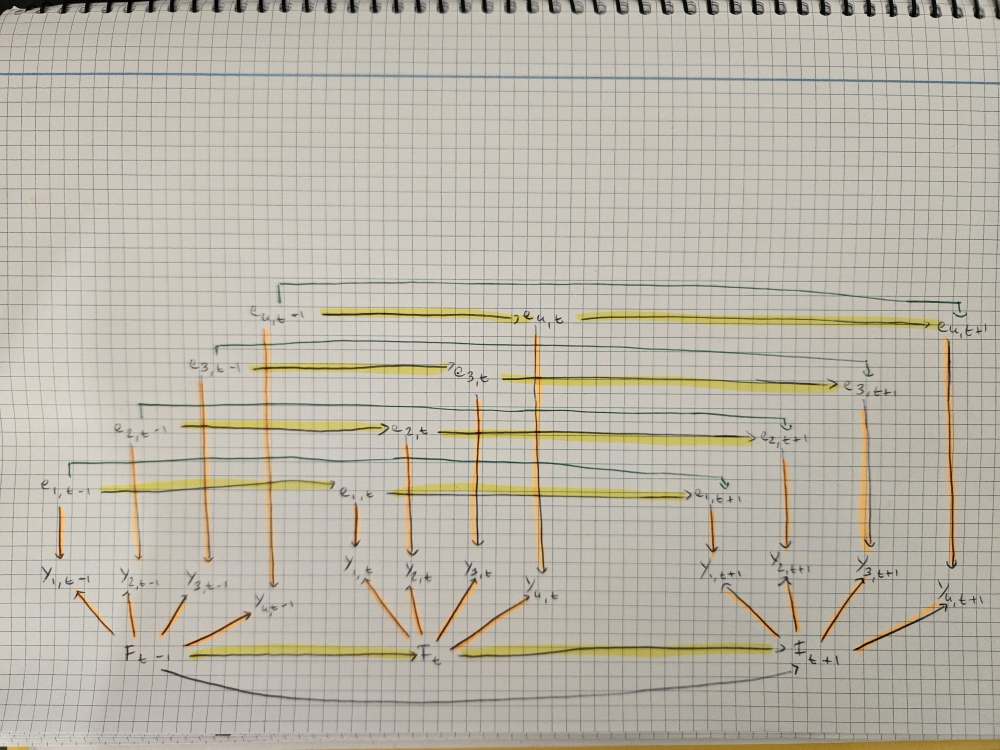

# Abstract

In a 1988 working paper, Stock and Watson proposed a framework to estimate and forecast short-run U.S. economic activity. Their model built on the premise that comovements across multiple macroeconomic variables can be captured by a single, unobserved latent variable. Specifically, they hypothesized that their four chosen indicators form a dynamic one-factor model, where the latent factor represents the state of the business cycle and can therefore be mapped to Gross Domestic Product (GDP) growth [@S&W1988].

The objective of this project is to empirically evaluate and extend the Stock and Watson (S&W) model. First, we will verify the assumptions of one-factor models, specifically by testing the tetrad constraints in a dynamic settings. Then, we will asses its predictive performance by replicating the model on more recent data and comparing the estimated latent factor to actual GDP growth. Furthermore, because macroeconomic data frequently exhibits heavy tailed behaviors, we will test the robustness of the Kalman filter by simulating economies under progressively more elliptical distribution.

Finally, we will expand the number of indicators included in the model by incorporating more macroeconomic variables. To avoid adding too many variables, and therefore too much noise to the model, we will apply a Lasso penalty to the factor loadings of the indicators. Specifically, we will force sparsity on the new indicators, while simultaneously not assigning any penalty to the original four indicators in order to retain them. With this setup, we will ensure that the original four indicators will still represent the foundation of our model, while squeezing extra predictive value out of a larger dataset.

# 1. The Stock & Watson model

We first replicate model proposed by Stock and Watson. Their model assumes that the comovements of four macroeconomic indicators are driven by a single, unobserved latent factor which represents the overall business cycle. Formally, the model is represented by the following structural equations:

-   The measurement equation: $y_t = \lambda f_{t} + e_{t}$
-   The factor transition equation: $f_{t} = \phi_{1}f_{t-1} + \phi_{2}f_{t-2} + w_{t}, \quad w_{t} \sim i.i.d. N(0,1)$
-   The error transition equation: $e_{t} = \psi_{1}e_{t-1} + \psi_{2}e_{t-2} + \epsilon_{t}, \quad \epsilon_{t} \sim i.i.d. N(0, \sigma_{i}^{2})$

Where:

-   $y_t$ is the $(4 \times 1)$ vector of normalized log-differences of the indicators at time $t$
-   $\lambda$ is the $(4 \times 1)$ vector of coefficients
-   $f_t$ is the $(1 \times 1)$ factor scalar at time $t$
-   $e_t$ is the $(4 \times 1)$ vector of errors at time $t$

Noticeably, to capture the cyclic patter of business cycles, both the factor and the error follow an $AR(2)$ process. Visually, the model can be represented by the following graphical model:



```{r}
### LIBRARIES

library("tidyverse")
library("readxl")
library("tidyquant")

### LOADING DATA

# FRED IDs:
ids <- c(
  "GDPC1",     # Real GDP
  "INDPRO",    # Industrial Production
  "CMRMTSPL",  # Manufacturing & Trade Sales
  "PAYEMS",    # Nonfarm Payrolls
  "W875RX1"    # Real Personal Income less Transfers 
)

# Defining path for local data cache (for rendering)
data_file <- "fred_macro_data.rds"

# Checking if data is already downloaded
if (file.exists(data_file)) {
  # If yes, load it locally (bypassing FRED API)
  raw_data <- read_rds(data_file)
} else {
  # If no, download from FRED and save it for future renders
  raw_data <- tq_get(ids, get = "economic.data",
                     from = "1969-10-01", to = "2026-01-01")
  write_rds(raw_data, data_file)
}

# Pivoting data in wide format
data_monthly <- raw_data %>%
  pivot_wider(names_from = symbol, 
              values_from = price) %>%
  arrange(date)

# Aligning the GDP measurement
df_aligned <- data_monthly %>%
  arrange(date) %>%
  mutate(GDPC1 = lag(GDPC1, 2))

# Applying log differences to obtain the final dataset
df_clean <- df_aligned %>%
  arrange(date) %>%
  mutate(
    # Log-difference for the 4 monthly variables (lag = 1)
    across(c(INDPRO, CMRMTSPL, PAYEMS, W875RX1), 
           ~ (log(.x) - log(lag(.x, 1))) * 100),
    
    # Log-difference for the quarterly GDP (lag = 3)
    GDPC1 = (log(GDPC1) - log(lag(GDPC1, 3))) * 100
  ) %>%
  # Dropping the very first row since month-over-month lag creates an NA
  drop_na(PAYEMS)

### DEFINING THE DATA ###

# gdp data
gdp <- df_clean %>%
  select(GDPC1) %>%
  drop_na(GDPC1) %>%
  as.matrix()

# Matrix of indicators
y_raw <- df_clean %>%
  select(- date, - GDPC1) %>%
  as.matrix()

### NORMALIZING DATA ###

# demeaning the y time series and standardizing it
y <- scale(y_raw)

TT <- nrow(y) # number of observations
n <- ncol(y) # number of indicators

# normalizing the variance of w to 1
varQ <- 1
```

## 1.1. Latent factor estimation

Given that the model is linear and that shocks $w_t$ and $w_t$ are assumed to be Gaussian and independent, the optimal estimator for the latent factor is given by the Kalman filter [@kalman1960]. However, this estimation technique requires the errors of the measurement equation $e_t$ to be independent white noise, differently from the $AR(2)$ specification of the S&W model. To overcome this limitation, we take the $AR(2)$ errors out of the measurement equation and include them into the latent state vector, alongside the current and lagged values of the factor. The structural equations simplify to:

-   The measurement equation: $y_t = H h_{t}$
-   The factor transition equation: $h_{t} = Fh_{t-1} + v_{t}, \quad v_{t} \sim i.i.d. N(0,\sigma)$

Where $h_{t}$ is the state vector which now includes the current and lagged values of both the factor and the error. With this structure, the $F$ matrix handles the $AR(2)$ dynamics of both the factor and the error.

## 1.2. Mapping the latent factor to GDP growth {#kalman-filter}

After estimating the latent factor via the Kalman filter, we must rescale it to make it interpretable in terms of actual economic activity. To do so, we regress GDP onto the estimated factor by Ordinary Least Squares (OLS). This allows us to plot the estimated latent factor against GDP growth and calculate in-sample performance metrics, such as the coefficient of determination ($R^2$) and the Mean Squared Error (MSE).

```{r}
### MATRIX FUNCTION ###

# Function that obtains matrices given the input parameter vector 'th'
# Note that 'th' is the vector of parameters which likelihood will be maximized by the maximum likelihood function
# the ML function
matrices <- function(th, n, varQ) {
  
  ### H: measurement matrix
  
  # Manually defined matrix 'h1' (used to extract the errors from the h vector)
  h1 <- rbind(
    c(1, 0, 0, 0, 0, 0, 0, 0),
    c(0, 0, 1, 0, 0, 0, 0, 0),
    c(0, 0, 0, 0, 1, 0, 0, 0),
    c(0, 0, 0, 0, 0, 0, 1, 0)
  )
  # combine the h1 matrix to the first four coefficients (lamba 1 to 4)
  Hmat <- cbind(th[1:n], matrix(0, nrow = n, ncol = 1), h1)
  
  ### F: transition matrix
  
  # Manually creating rows of the transition matrix
  # phi1 and phi2
  f1  <- c(th[n + 1], th[n + 2], 0, 0, 0, 0, 0, 0, 0, 0)
  f2  <- c(1, 0, 0, 0, 0, 0, 0, 0, 0, 0)
  # psi11 and psi12
  f3  <- c(0, 0, th[n + 3], th[n + 4], 0, 0, 0, 0, 0, 0)
  f4  <- c(0, 0, 1, 0, 0, 0, 0, 0, 0, 0)
  # psi21 and psi22
  f5  <- c(0, 0, 0, 0, th[n + 5], th[n + 6], 0, 0, 0, 0)
  f6  <- c(0, 0, 0, 0, 1, 0, 0, 0, 0, 0)
  # psi31 and psi 32
  f7  <- c(0, 0, 0, 0, 0, 0, th[n + 7], th[n + 8], 0, 0)
  f8  <- c(0, 0, 0, 0, 0, 0, 1, 0, 0, 0)
  # psi41 and psi42
  f9  <- c(0, 0, 0, 0, 0, 0, 0, 0, th[n + 9], th[n + 10])
  f10 <- c(0, 0, 0, 0, 0, 0, 0, 0, 1, 0)
  
  # Construct the final F matrix
  Fmat <- rbind(f1, f2, f3, f4, f5, f6, f7, f8, f9, f10)
  
  ### R: variance-covariance matrix of the observation equation idiosyncratic error w
  
  # In our case it's just a matrix of 0s given that the error got incorporated into 
  # the signal vector
  Rmat <- matrix(0, nrow = n, ncol = n)
  
  # Q matrix (variance-covariance matrix of state shocks)
  # Note that the th values here represent the standard deviations of the idiosyncratic
  # errors (w is the first one, and then epsilon 1 to 4)
  th2_val <- kronecker(th[(n + 11):(n + 14)]^2, matrix(c(1, 0), ncol = 1))
  # We create the final diagonal matrix (since correlation between the errors is 0)
  Qmat <- diag(c(varQ, 0, as.vector(th2_val)))
  
  # Finally, put all of the matrices into a list, which will be later unpacked by the 
  # function to compute the likelihood
  return(list(Rmat = Rmat, Qmat = Qmat, 
              Hmat = Hmat, Fmat = Fmat))
}

### KALMAN FILTER FUNCTION ###

# Objective function for the Likelihood
kalman <- function(th, y, n, TT, varQ) {
  
  # Initialization (pull matrices, set initial values, initialize vectors)
  
  # Get matrices
  mats <- matrices(th, n, varQ)
  Hmat <- mats$Hmat
  Fmat <- mats$Fmat
  Rmat <- mats$Rmat
  Qmat <- mats$Qmat
  
  # Initial state (initial value of the signal): h_{0|0} = 0
  h00 <- matrix(0, nrow = 10, ncol = 1) 
  # Initial MSE (initial value of the variance): P_{0|0} = I
  Pmat00 <- diag(10)
  
  # Initializing the vector to store the likelihood
  like <- matrix(0, nrow = TT, ncol = 1)
  
  # Initializing the vector to store the signal
  filter_mat <- matrix(0, nrow = TT, ncol = 10)
  
  # Kalman filter loop
  
  # for loop for each observation
  for(it in 1:TT) {
    
    # Step 1: prediction of ht given info at t-1
    h10 <- Fmat %*% h00                     
    
    # Step 2: prediction of Pt given info at t-1
    Pmat10 <- Fmat %*% Pmat00 %*% t(Fmat) + Qmat
    
    # Step 3: prediction of yt given info at t-1
    y10 <- Hmat %*% h10
    
    # Step 4: estimation of the forecast error
    e10 <- matrix(y[it, ], ncol = 1) - y10
    
    # Step 5: estimation of the variance of the forecast error
    Fmat10 <- Hmat %*% Pmat10 %*% t(Hmat) + Rmat                  
    
    # Log-Likelihood Calculation (see section 2.3.4)
    like[it] <- -0.5 * (log(2 * pi * det(Fmat10)) + (t(e10) %*% solve(Fmat10) %*% e10))
    
    # Step 6: Kalman gain
    Kmat <<- Pmat10 %*% t(Hmat) %*% solve(Fmat10)
    
    # Step 7: updating of filter and variance
    # filter
    h11 <- h10 + Kmat %*% e10
    # variance
    Pmat11 <- Pmat10 - Kmat %*% Hmat %*% Pmat10
    
    # Iterating
    filter_mat[it, ] <- t(h11)
    h00 <- h11
    Pmat00 <- Pmat11
  }
  
  # Returning a list containing both the likelihood and the extracted matrices
  return(list(
    neg_loglik = -sum(like),
    filter_mat = filter_mat,
    Fmat = Fmat
  ))
}

### FUNCTION THAT RETURNS ONLY THE LIKELIHOOD ###

# optim() requires a function that returns only the scalar to minimize
ofn <- function(th, y, n, TT, varQ) {
  res <- kalman(th, y, n, TT, varQ)
  return(res$neg_loglik)
}

### COEFFICIENT ESTIMATION ###

# Initial guesses for parameters
B <- matrix(c(0.9, 0.8, 0.7, 0.6), ncol = 1) # Loadings
phif <- matrix(0.3, nrow = 2, ncol = 1)      # Factor AR(2) coefficients
phiy <- matrix(0.3, nrow = n * 2, ncol = 1)  # Error AR(2) coefficients
v <- matrix(apply(y, 2, sd), ncol = 1)       # Error variances

# Vector of initial parameters
startval <- rbind(B, phif, phiy, v)

# run once, save
if (!file.exists("results/kalman_results.RData")) {
  opt_res <- optim(par = as.vector(startval), 
                 fn = ofn,
                 y = y, n = n, TT = TT, varQ = varQ,
                 method = "BFGS", 
                 hessian = TRUE,
                 control = list(maxit = 2000))
  save(opt_res, file = "results/kalman_results.RData")
} else {
  load("results/kalman_results.RData")
}

# Computing standard errors
cramerrao <- solve(opt_res$hessian)
std_err <- sqrt(diag(cramerrao))

### EXTRACTING THE FINAL FACTOR (Post-Estimation) ###

# Running the filter again with the optimal parameters
final_kf <- kalman(opt_res$par, y, n, TT, varQ)

# Extracting the filer matrix
filter_mat <- final_kf$filter_mat

# Extracting the factor
factor <- filter_mat[, 1]

# Extracting Fmat for the forecast steps
Fmat <- final_kf$Fmat 

### COVERTING FACTOR TO QUARTERLY GROWTH RATE ###

# Converting monthly factor into a quarterly equivalent
factorQ <- (1/3) * factor[5:length(factor)] + 
  (2/3) * factor[4:(length(factor) - 1)] + 
  factor[3:(length(factor) - 2)] + 
  (2/3) * factor[2:(length(factor) - 3)] + 
  (1/3) * factor[1:(length(factor) - 4)]

# Extracting every 3rd month to match quarterly GDP
i <- 1
factgdp <- c()
while(i < (TT - 4)) {
  factgdp <- c(factgdp, factorQ[i])
  i <- i + 3
}
```

```{r}
### FORECAST ###

# Extracting the last row of the filter matrix (hT|T)
hTT <- filter_mat[nrow(filter_mat), ]

# Forecasting

# Estimate the future factor values (just 5 quarters into the future)
hT1T <- Fmat %*% hTT
hT2T <- Fmat %*% hT1T
hT3T <- Fmat %*% hT2T
hT4T <- Fmat %*% hT3T
hT5T <- Fmat %*% hT4T

# Append the 5 new forecasted factors (1st element of each state vector) 
# to the historical factor vector
factor2 <- c(factor, hT1T[1], hT2T[1], hT3T[1], hT4T[1], hT5T[1])

# Converting to quarterly growth rates
factor2Q <- (1/3) * factor2[5:length(factor2)] + 
  (2/3) * factor2[4:(length(factor2) - 1)] + 
  factor2[3:(length(factor2) - 2)] + 
  (2/3) * factor2[2:(length(factor2) - 3)] + 
  (1/3) * factor2[1:(length(factor2) - 4)]

# Downsampling to extract every 3rd month
length <- length(factor2Q)
i <- 1
factgdp2 <- c()

while(i <= length) {
  fac1 <- factor2Q[i]
  factgdp2 <- c(factgdp2, fac1)
  i <- i + 3
}

# Estimating the GDP

# Defining the data
y_gdp <- gdp

# Creating the X matrix with a column of 1s for the intercept
x <- cbind(1, factgdp)

# Computing the OLS coefficients
b <- solve(t(x) %*% x) %*% t(x) %*% y_gdp

# Generating the forecast, predicting the next two quarters
yhat1 <- b[1] + b[2] * factgdp2[length(factgdp2) - 1]
yhat2 <- b[1] + b[2] * factgdp2[length(factgdp2)]
```

```{r}
### IN-SAMPLE ESTIMATES OF GDP AND PERFORMANCE MEASURES ###

# Translating all historical factors into estimated GDP 
gdp_fitted <- x %*% b

# Calculating the residuals
residuals <- y_gdp - gdp_fitted

# Calculating Mean Squared Error (MSE)
mse <- mean(residuals^2)

# Calculating R-squared
ss_tot <- sum((y_gdp - mean(y_gdp))^2)
ss_res <- sum(residuals^2)
r_squared <- 1 - (ss_res / ss_tot)

### PLOTTING ###

# Combining the data into a tibble
plot_data <- tibble(
  Index = 1:length(y_gdp), # <--- ADD THIS: Creates a numeric sequence from 1 to T
  Actual = as.vector(y_gdp),
  Fitted = as.vector(gdp_fitted)
) %>%
  # Pivot to long format for ggplot2
  pivot_longer(cols = c(Actual, Fitted), names_to = "Series", values_to = "Value")

# Generating the plot
ggplot(plot_data, aes(x = Index, y = Value, color = Series)) + # <--- CHANGE x = Index
  geom_line(linewidth = 0.8) +
  
  # Set specific colors to easily distinguish the series
  scale_color_manual(values = c("Actual" = "dodgerblue3", "Fitted" = "red3")) +
  
  # Add titles, labels, and dynamically inject the R-squared and MSE
  labs(
    title = "In-Sample Estimation: Actual vs. Fitted GDP",
    subtitle = sprintf("Performance Metrics: R-squared = %.4f | MSE = %.4f", r_squared, mse),
    x = "Time (Index)", # <--- Update x-axis label
    y = "GDP Growth (Log Difference)",
    color = NULL
  ) +
  
  # Apply a clean, academic theme
  theme_minimal() +
  theme(
    legend.position = "bottom",
    plot.title = element_text(face = "bold", size = 14),
    plot.subtitle = element_text(color = "darkgrey", size = 11)
  )
```

The empirical results demonstrate the strong explanatory power of the model proposed by Stock & Watson. The mapped factor explains approximately 76% of the total variance of the actual GDP growth ($R^2 = 0.7595$ ). Moreover, the model yields an in-sample MSE of 0.277, translating to a Root Mean Squared Error (RMSE) of roughly 0.526 percentage points. This RMSE might seems elevated, but it's important to note that our dataset includes periods of extreme macroeconomic volatility, such as the 2008 and COVID-19 crises, which inflate the error metrics.

## 1.3. The normality assumption 

The dynamic factor model proposed by Stock and Watson explicitly assumes that all structural shocks are purely Gaussian. However, economic cycles frequently feature sudden and massive shocks (e.g. the COVID-19 crisis), hence macroeconomic indicators are rarely normally distributed. Instead, they tend to exhibit heavy-tailed behavior. As illustrated in the  Quantile-Quantile (Q-Q) plot below, the distribution of our indicators indeed deviates from normality, confirming the presence of fat tails.

```{r}
### CHECKING NORMALITY ASSUMPTION ###

# Reshaping the data to long format
plot_data <- df_clean %>%
  select(INDPRO, CMRMTSPL, PAYEMS, W875RX1) %>%
  pivot_longer(cols = everything(), names_to = "Indicator", values_to = "Value") %>%
  group_by(Indicator) %>%
  # Standardize
  mutate(Value_Scaled = scale(Value))

# Q-Q Plots
p_qq <- ggplot(plot_data, aes(sample = Value_Scaled)) +
  stat_qq(color = "steelblue", alpha = 0.6) +
  stat_qq_line(color = "red3", linewidth = 0.7) +
  facet_wrap(~Indicator) +
  theme_minimal() +
  labs(title = "Normal Q-Q Plot for Macro Indicators",
       subtitle = "Points deviating from the red line indicate non-Gaussian 'fat tails'")

print(p_qq)

```

Despite the violation of the normality assumption, the Kalman filter extracts a consistent estimate of the latent factor. Indeed, when the parameters are estimated via Gaussian quasi-maximum likelihood, consistency of the parameter estimates is preserved under non-Gaussianity, though with loss of efficiency in finite samples as the distribution moves away from Gaussianity and gets increasingly elliptical [@white1982]. Chapter 2 will be dedicated to an empirical demonstration of the robustness of the Kalman filter, by simulating the economic model proposed by S&W under increasingly elliptical distributions.

## 1.4 Verifying that there is only one underlying factor (TO FINISH)

However, from our class we know that tetrad constraints to verify that there is only one underlying factor still hold under more elliptical distributions. Note, however, that tetrad constraints cannot be identified in a static way anymore, because the one factor model is dynamic. However, we can still verify them on the autocovariance structure (expand the explanation).

```{r}
### DYNAMIC TETRAD CONSTRAINTS ###

# Function to compute empirical cross-covariance matrix at lag tau
cross_cov_matrix <- function(y, tau) {
  TT <- nrow(y)
  # y_t is from tau+1 to TT
  y_t <- y[(tau + 1):TT, ]
  # y_lag is from 1 to TT-tau
  y_lag <- y[1:(TT - tau), ]
  
  # Compute the covariance matrix between y_t and y_lag
  cov_mat <- cov(y_t, y_lag)
  return(cov_mat)
}

# Function to compute the three tetrads for a given covariance matrix
compute_tetrads <- function(sigma) {
  t1 <- sigma[1, 2] * sigma[3, 4] - sigma[1, 3] * sigma[2, 4]
  t2 <- sigma[1, 2] * sigma[3, 4] - sigma[1, 4] * sigma[2, 3]
  t3 <- sigma[1, 3] * sigma[2, 4] - sigma[1, 4] * sigma[2, 3]
  
  return(c(Tetrad_1 = t1, Tetrad_2 = t2, Tetrad_3 = t3))
}

# We want to check this for a few different lags (e.g., lags 1 through 5)
max_lag <- 6
tetrad_results <- matrix(NA, nrow = max_lag + 1, ncol = 3)
colnames(tetrad_results) <- c("Tetrad 1", "Tetrad 2", "Tetrad 3")
rownames(tetrad_results) <- paste("Lag", 0:max_lag)

# Loop through the lags, compute the cross-covariance, and extract tetrads
for (tau in 1:max_lag) {
  sigma_tau <- cross_cov_matrix(y, tau)
  tetrad_results[tau + 1, ] <- compute_tetrads(sigma_tau)
}

sigma_0 <- cov(y)
tetrad_results[1,] <- compute_tetrads(sigma_0)

# Convert the matrix to a tibble, moving row names into a new column called "Lag"
tetrad_tibble <- as_tibble(tetrad_results, rownames = "Lag")

# Print the beautiful new tibble
knitr::kable(tetrad_tibble, digits = 4, caption = "Empirical Dynamic Tetrad Constraints")
```


# 2. Breaking Gaussianity

The Kalman filter is derived under the assumption that all structural shocks follow a Gaussian distribution, which grants it the property of being the minimum variance unbiased estimator of the latent factor. When this assumption is violated, the filter estimated via Gaussian quasi-maximum likelihood remains consistent, meaning the estimated parameters still converge to their true values as $T \rightarrow \infty$, but **loses efficiency in finite samples**.

The reason for this is that under a misspecified likelihood, the Kalman gain is no longer optimal; therefore, the filter requires more observations to achieve the same precision as it would under correctly specified Gaussian shocks. This efficiency loss is particularly relevant for macroeconomic data, which with fewer than 700 observations can never be confidently characterized as truly Gaussian, and empirically exhibits heavy tailed behavior consistent with a student-t distribution [@geweke1993]. We evaluate this by simulating the S&W data generating process under three distributional assumptions of increasing complexity: Gaussian, student-t, and skew-t, the latter of which introduces nonzero skewness via a slant parameter $\alpha \neq 0$.

## 2.1 Gaussian Distribution {#gaussian-dist}

To simulate Gaussian data into our Kalman filter, we generate a structured array of various sample sizes to evaluate how the estimator performs in finite samples and what happens to its performance as $T \rightarrow \infty$. 

For each sample size, we generate a true latent factor following an AR(2) process with coefficient values of $\hat{\phi}_1 = 0.293$ and $\hat{\phi}_2 = -0.098$, estimated from the S&W model in @kalman-filter, with Gaussian shocks by assumption. We then construct the observable data by multiplying the true factor by the estimated factor loadings from @kalman-filter and adding normally distributed idiosyncratic errors, replicating the structure of the S&W measurement equation. 

The simulated observables are normalized and fed into the Kalman filter, and the correlation between the estimated factor $\hat{f}_t$ and the true factor $f_t$ is recorded across all sample sizes.

```{r gaussian function}
run_gaussian <- function(tt){
  
# 0. define factor coefficients
phi1 <- opt_res$par[5]
phi2 <- opt_res$par[6]

# 0. factor loadings extracted from S&W 
lambda <- opt_res$par[1:4]

# 1. generate fake factor
f_true <- numeric(tt)
for (t in 3:tt)
  f_true[t] <- phi1*f_true[t-1] + phi2*f_true[t-2] + rnorm(1)

# force observables through 4 series using estimated loadings
Y_normal <- f_true %*% t(lambda) + matrix(rnorm(tt*4), tt, 4)

# normalize
Y_normal <- scale(Y_normal)

# run kalman
final_sim <- kalman(opt_res$par, 
                    Y_normal, 
                    n = 4, 
                    TT = tt, 
                    varQ)

f_hat <- final_sim$filter_mat[, 1]

cor(f_hat, f_true)
}
```

We first run a single iteration across sample sizes generated from `seq(10, 10000, by = 50)`, such that the lower bound captures realistic finite sample sizes representative of macroeconomic datasets, while the upper bound approaches the asymptotic nature of a dataset, where the property of consistency is expected to hold.

```{r gaussian test run, eval=FALSE}
# one iteration
TT <- seq(10, 10000, by = 50)
results1 <- data.frame(
  sample_size = TT,
  Gaussian = sapply(TT, function(tt) run_gaussian(tt))
)
```

```{r save gaussian, echo=FALSE, eval=FALSE}
# save sim results
save(results1, file = "results/gaussian_results.RData")
```


```{r gaussian plotting data, echo=FALSE}
# load in data
load(file = "results/gaussian_results.RData")

# pivot to long format for plotting
results_long1 <- results1 %>%
  pivot_longer(cols = c(Gaussian), 
               names_to = "Distribution", 
               values_to = "Correlation")
```

```{r compute convergence value, echo=FALSE, eval=FALSE}
# CHECK: what is the value converging to asymptotically?
asymptotic_cor <- mean(replicate(50, run_gaussian(50000)))
saveRDS(object = asymptotic_cor, 
        file = "results/asymptotic_cor")
```


```{r load in convergence value, echo=FALSE}
# load in value to reference in-line w/ text
asymptotic_cor <- round(readRDS(file = 'results/asymptotic_cor'),4)
```


```{r gaussian plot, echo=FALSE}
#| label: fig-gaussian
#| fig-cap: "Factor Recovery vs Sample Size under Gaussian Shocks"

ggplot(results_long1, aes(x = sample_size, 
                          y = Correlation, 
                          color = Distribution)) +
  geom_line(linewidth = 0.8) +
  annotate("segment", 
           x = 0, xend= 10100,
           y = asymptotic_cor, yend = asymptotic_cor,
           linetype = "dashed", color = "black", linewidth = 0.5) +
  scale_y_continuous(limits = c(0.70, 0.85))+
  scale_color_manual(values = c("Gaussian" = "dodgerblue3")) +
  labs(title = "Factor Recovery vs Sample Size",
       x = "Sample Size (TT)", y = "Mean Correlation", color = NULL,
       caption = paste("Dashed line indicates asymptotic factor recovery:",
                       asymptotic_cor)) +
  theme_minimal() +
  theme(legend.position = "bottom",
        plot.title = element_text(hjust=0.5),
        plot.subtitle = element_text(hjust=0.5),
        plot.caption = element_text(hjust=0.5))
```

```{r save gaussian plot, eval=FALSE, echo=FALSE}
# save plot image
ggsave(filename = "images/gaussian_plot.png",
       width=8, height=5, dpi=300)
```

We see from @fig-gaussian that factor recovery under Gaussian shocks is stable across all sample sizes, with correlation between the estimated and true factor converging to approximately `r asymptotic_cor` as $T$ grows. The relatively high recovery even at small sample sizes is consistent with the Kalman filter being the minimum variance estimator under correctly specified Gaussian shocks, confirming that no efficiency loss is present when the distributional assumption holds.

## 2.2 Student-t Distribution {#student-t-dist}

To break the assumption of Gaussianity, we simulate the S&W data generating process under a student-t distribution, which is well documented as a realistic characterization of finite sample macroeconomic data [@geweke1993].

Theoretically, given the QMLE consistency result, we should expect the Kalman filter to remain consistent in its recovery of the latent factor, meaning the estimates converge to the true factor as $T \rightarrow \infty$. However, we expect to observe an efficiency loss in finite samples, as the Kalman gain is derived under the Gaussian likelihood and is therefore suboptimal when the true distribution has heavier tails [@white1982; @DurbinKoopman2012].

```{r student_t function, echo=FALSE}
run_student_t <- function(tt){
  
# 0. define factor coefficients
phi1 <- opt_res$par[5]
phi2 <- opt_res$par[6]
  
# 0. factor loadings extracted from S&W
lambda <- opt_res$par[1:4]
  
# 1. generate fake factor
f_true <- numeric(tt)
for (t in 3:tt)
  f_true[t] <- phi1*f_true[t-1] + phi2*f_true[t-2] + rt(1, df=5)/sqrt(5/3)

# force observables through 4 series using estimated loadings
Y_normal <- f_true %*% t(lambda) + matrix(rt(tt*4, df=5) / sqrt(5/3),
                                          tt, 4)

# normalize
Y_normal <- scale(Y_normal)

# run kalman
final_sim <- kalman(opt_res$par, 
                    Y_normal, 
                    n = 4, 
                    TT = nrow(Y_normal), 
                    varQ)
f_hat <- final_sim$filter_mat[, 1]

# results
cor(f_hat, f_true)
}
```


```{r student_t test run, eval=FALSE}
# one iteration
TT <- seq(10, 10000, by = 50)
results2 <- data.frame(
  sample_size = TT,
  Student_t = sapply(TT, function(tt) run_student_t(tt))
)
```

```{r save student t, echo=FALSE, eval=FALSE}
# save sim results
save(results2, file = "results/student_t_results.RData")
```

```{r student_t plotting data, echo=FALSE}
# load in data
load(file = "results/student_t_results.RData")

# format data to long for plotting
results_long2 <- results2 %>%
  pivot_longer(cols = c(Student_t), 
               names_to = "Distribution", 
               values_to = "Correlation")
```


```{r student_t plot, echo=FALSE}
#| label: fig-student-t
#| fig-cap: "Factor Recovery vs Sample Size under Student-t Shocks"

# plot
ggplot(results_long2, aes(x = sample_size, 
                          y = Correlation, 
                          color = Distribution)) +
  geom_line(linewidth = 0.8) +
  annotate("segment", 
           x = 0, xend= 10100,
           y = asymptotic_cor, yend = asymptotic_cor,
           linetype = "dashed", color = "black", linewidth = 0.5) +
  scale_color_manual(values = c("Student_t" = "salmon")) +
  scale_y_continuous(limits = c(0.7,0.85)) +
  labs(title = "Factor Recovery vs Sample Size",
       x = "Sample Size (TT)", y = "Mean Correlation", color = NULL,
       caption = paste("Dashed line indicates asymptotic factor recovery:",
                       asymptotic_cor)) +
  theme_minimal() +
  theme(legend.position = "bottom",
        plot.title = element_text(hjust=0.5),
        plot.subtitle = element_text(hjust=0.5),
        plot.caption = element_text(hjust=0.5))
```

```{r save student-t plot, eval=FALSE, echo=FALSE}
# save plot image
ggsave(filename = "images/student_t_plot.png",
       width=8, height=5, dpi=300)
```

As illustrated in @fig-student-t, the Kalman filter remains consistent under student-t shocks, with factor recovery converging to approximately `r asymptotic_cor` as $T \rightarrow \infty$, in line with the Gaussian baseline from @gaussian-dist.

However, the trajectory is notably more volatile across sample sizes, particularly in the finite sample realm where the correlation fluctuates significantly before stabilizing. This is consistent with the theoretical prediction that the Kalman filter loses efficiency under heavy tailed distributions, as the misspecified Gaussian likelihood produces a suboptimal Kalman gain that requires more observations to average out the influence of extreme draws. 

In other words, the fat tails of the student-t distribution introduce large idiosyncratic shocks that the filter struggles to separate from the common factor signal at small $T$, resulting in noisier factor recovery relative to the Gaussian case.

## 2.3 Skewed-Elliptical {#skew-t-dist}

For a more complex distributional assumption, we simulate the S&W data generating process under a skew-t distribution, which extends the student-t by introducing asymmetry via a nonzero slant parameter $\alpha \neq 0$.

Specifically, we set `alpha = 5` which induces a positive skew, meaning the distribution has a longer right tail relative to the symmetric student-t case. Note that our simulated factor shocks are generated as follows:

```{r skew_t fake factor, eval=FALSE}
# generate fake factor
factor_shocks <- rst(tt, xi=0, omega=1, alpha=5, nu=5)
factor_shocks <- factor_shocks - mean(factor_shocks)
```

The factor shocks are recentered by subtracting the sample mean, as the skew-t distribution has a nonzero mean when $\alpha \neq 0$, which would otherwise violate the zero mean assumption of the Kalman filter and introduce a systematic bias into the factor estimates.

```{r skew_t function, echo=FALSE}
library(sn)

run_skew_t <- function(tt){
 
# 0. define factor coefficients
phi1 <- opt_res$par[5]
phi2 <- opt_res$par[6]
  
# 0. factor loadings extracted from S&W
lambda <- opt_res$par[1:4]
  
# 1. generate fake factor
factor_shocks <- rst(tt, xi=0, omega=1, alpha=5, nu=5)
factor_shocks <- factor_shocks - mean(factor_shocks)

f_true <- numeric(tt)
for (t in 3:tt)
  f_true[t] <- phi1*f_true[t-1] + phi2*f_true[t-2] + factor_shocks[t]

# force observables through 4 series using your estimated loadings
shocks <- rst(tt*4, xi=0, omega=1, alpha=5, nu=5)
shocks <- shocks - mean(shocks)

Y_normal <- f_true %*% t(lambda) + matrix(shocks, tt, 4)

# normalize
Y_normal <- scale(Y_normal)

# run kalman
final_sim <- kalman(opt_res$par, 
                    Y_normal, 
                    n = 4, 
                    TT = nrow(Y_normal), 
                    varQ)
f_hat <- final_sim$filter_mat[, 1]

cor(f_hat, f_true)
}
```

```{r skew_t test run, eval=FALSE}
# one iteration
TT <- seq(10, 10000, by = 50)
results3 <- data.frame(
  sample_size = TT,
  Skew_t = sapply(TT, function(tt) run_skew_t(tt))
)
```

```{r save skew_t, echo=FALSE, eval=FALSE}
# save sim results
save(results3, file = "results/skew_t_results.RData")
```


```{r skew_t load plotting data, echo=FALSE}
# load in data
load(file = "results/skew_t_results.RData")

# check recovery
results_long3 <- results3 %>%
  pivot_longer(cols = c(Skew_t), 
               names_to = "Distribution", 
               values_to = "Correlation")
```


```{r skew_t plot, echo=FALSE}
#| label: fig-skew-t
#| fig-cap: "Factor Recovery vs Sample Size under Skew-t Shocks"

# plot skew_t
ggplot(results_long3, aes(x = sample_size, 
                          y = Correlation, 
                          color = Distribution)) +
  geom_line(linewidth = 0.8) +
  annotate("segment", 
           x = 0, xend= 10100,
           y = asymptotic_cor, yend = asymptotic_cor,
           linetype = "dashed", color = "black", linewidth = 0.5) +
  scale_y_continuous(limits = c(0.7,0.85)) +
  scale_color_manual(values = c("Skew_t" = "gold1")) +
  labs(title = "Factor Recovery vs Sample Size",
       x = "Sample Size (TT)", y = "Mean Correlation", color = NULL,
       caption = paste("Dashed line indicates asymptotic factor recovery:",
                       asymptotic_cor)) +
  theme_minimal() +
  theme(legend.position = "bottom",
        plot.title = element_text(hjust=0.5),
        plot.subtitle = element_text(hjust=0.5),
        plot.caption = element_text(hjust=0.5))
```


```{r save skew-t plot, eval=FALSE, echo=FALSE}
# save plot object
ggsave(filename= "images/skew_t_plot.png",
       width=8, height=5, dpi=300)
```

Indeed, from our results in @fig-skew-t we see that the Kalman filter remains consistent under skew-t shocks, with factor recovery converging to approximately `r asymptotic_cor` as $T \rightarrow \infty$, in line with both the Gaussian and student-t baselines. This confirms the QMLE consistency result, as the estimator recovers the true latent factor regardless of the distributional assumption placed on the shocks. 

However, the trajectory is notably more volatile relative to both the Gaussian and student-t cases, with correlation fluctuating between 0.75 and 0.85 even at large sample sizes. This persistent volatility reflects the additional efficiency cost introduced by the nonzero skewness of the shock distribution, as the positive slant parameter $\alpha = 5$ generates asymmetric extreme draws that the Kalman filter, operating under a misspecified Gaussian likelihood, struggles to average out even at large $T$.

## 2.4 Monte Carlo Simulation

```{r mc sim, eval=FALSE}
####################################################################
## DO NOT RUN! Will take hours to complete, objects already saved ##
####################################################################

# run simulation 50 times, take the average 
TT <- seq(10, 10000, by = 50)

# gaussian
results1 <- data.frame(
  sample_size = TT,
  Gaussian = sapply(TT, function(tt) mean(replicate(50, run_gaussian(tt))))
)

# student-t
results2 <- data.frame(
  sample_size = TT,
  Student_t = sapply(TT, function(tt) mean(replicate(50, run_student_t(tt))))
)

# skew-t
results3 <- data.frame(
  sample_size = TT,
  Skew_t = sapply(TT, function(tt) mean(replicate(50, run_skew_t(tt))))
)

save(results1, results2, results3, file = "results/mc_results.RData")
```

```{r load mc plotting data, echo=FALSE}
# load 50 MC sim results
load("results/mc_results.RData")

# join dfs and reformat for plotting
results_all <- inner_join(results1, results2, by = "sample_size") %>% 
  inner_join(., results3, by = "sample_size")

results_long_all <- results_all %>%
  pivot_longer(cols = c(Gaussian, Student_t, Skew_t), 
               names_to = "Distribution", 
               values_to = "Correlation")
```


```{r mc results plot, echo=FALSE}
#| label: fig-mc-results
#| fig-cap: "Factor Recovery vs Sample Size, Averaged Across 50 MC Simulation"

# all plotted tg
ggplot(data= results_long_all,
       aes(x = sample_size, 
           y = Correlation, 
           color = Distribution,
           linetype=Distribution)) +
  annotate("segment", 
           x = 0, xend= 10100,
           y = asymptotic_cor, yend = asymptotic_cor,
           linetype = "dashed", color = "black", linewidth = 0.5) +
  geom_line(linewidth=0.8) +
  coord_cartesian(xlim = c(10, 10000), ylim = c(0.78, 0.81)) +
  scale_color_manual(values = c("Gaussian" = "dodgerblue2",
                                "Student_t" = "salmon",
                                "Skew_t" = "gold1")) +
  labs(title = "Factor Recovery vs Sample Size",
       subtitle = "Mean correlation over 50 replications",
       x = "Sample Size (TT)", y = "Mean Correlation", color = NULL,
       caption = paste("Dashed black line indicates asymptotic factor recovery:",
                       asymptotic_cor)) +
  theme_minimal() +
  guides(color = guide_legend("Distribution"), 
       linetype = guide_legend("Distribution")) +
  theme(legend.position = "bottom",
        plot.title = element_text(hjust=0.5),
        plot.subtitle = element_text(hjust=0.5),
        plot.caption = element_text(hjust=0.5))
```


```{r save mc plot, echo=FALSE, eval=FALSE}
# save plot object
ggsave(filename = "images/mc_results_50_plot.png",
       width = 8, height = 5, dpi = 300)
```

As illustrated in @fig-mc-results, the three distributions converge to the same asymptotic factor recovery correlation of approximately `r asymptotic_cor` as $T \rightarrow \infty$, directly confirming the QMLE consistency result. At small sample sizes, all three distributions exhibit greater volatility and slightly lower recovery, with the skew-t and student-t lines deviating more from the Gaussian baseline, consistent with the theoretical prediction of finite sample efficiency loss under non-Gaussianity. 

Notably, both the student-t and skew-t distributions exhibit greater volatility relative to the Gaussian baseline, particularly at small sample sizes, with the skew-t remaining the most volatile throughout. It should be noted that the y-axis range is intentionally narrow to highlight these differences, and as reported in @tbl-variance, the absolute magnitude of the fluctuations is small in practice, with standard deviations of $0.021$ and $0.027$ for the student-t and skew-t, respectively. Nevertheless, all three distributions converge to the same asymptotic recovery value of `r asymptotic_cor`, confirming the QMLE consistency result regardless of the distributional assumption.

## 2.5 Efficiency Loss under Non-Gaussian Data

```{r variable table, eval=FALSE}
# run 200 replications, store all correlations
n_reps <- 200
TT_fixed <- 675  # actual sample size from FRED data

cors_gaussian <- replicate(n_reps, run_gaussian(TT_fixed))
cors_student  <- replicate(n_reps, run_student_t(TT_fixed))
cors_skewt    <- replicate(n_reps, run_skew_t(TT_fixed))

# variance of factor recovery across replications
var_table <- data.frame(
  Distribution = c("Gaussian", "Student-t", "Skew-t"),
  Mean         = c(mean(cors_gaussian), mean(cors_student), mean(cors_skewt)),
  Variance     = c(var(cors_gaussian),  var(cors_student),  var(cors_skewt)),
  SD           = c(sd(cors_gaussian),   sd(cors_student),   sd(cors_skewt))
)
```

```{r save variance table, echo=FALSE, eval=FALSE}
# save table
saveRDS(var_table, "results/var_table.rds")
```


```{r variance table results, echo=FALSE}
#| label: tbl-variance
#| tbl-cap: "Factor Recovery: Mean and Variance across 200 Replications"

# load in table data
var_table <- readRDS("results/var_table.rds")

# kable
knitr::kable(var_table, digits = 6, 
             caption = "Factor Recovery: Mean and Variance across 200 Replications") %>% 
  kableExtra::kable_styling()

```

To formally demonstrate the efficiency loss under non-Gaussian distributions, we run 200 replications of the Monte Carlo simulation at the empirical sample size of $T = 675$, corresponding to the number of observations in our FRED dataset, and compute the variance of factor recovery across replications. 

As reported in @tbl-variance, the Gaussian estimator achieves the lowest variance of $0.000208$, confirming its optimality under correctly specified shocks. The student-t estimator exhibits a variance of $0.000430$, roughly twice that of the Gaussian case, while the skew-t estimator yields the highest variance of $0.000718$, approximately 3.5 times the Gaussian baseline. Importantly, the mean recovery is nearly identical across all three distributions at approximately $0.794$, confirming that the estimator remains consistent regardless of the distributional assumption. 

Together, these results provide formal evidence of the consistency without efficiency property of the Gaussian quasi-maximum likelihood Kalman filter: the estimator converges to the correct value under all three distributions, but requires significantly more observations to do so with the same precision when shocks are non-Gaussian.

# 3. Two-Factor Model 

motivation: want to improve performance (increase R^2 from 75%)

what happens when we generate a second latent variable by including more macro variables in the model? (I.e., we add in financial variables and generate financial latent factor) and we try to run S&W under the one-factor assumption? Should be biased, breaks; we try to recover the second latent factor with some sort of dynamic parallel analysis.

tdl:
- find vars to generate second variable
- build new model using vars, run thru kalman filter
- compare to results from part 1.1, show that it is biased
- explain why this is
- try to extract second latent factor using parallel analysis, need to show this in section 1 before Kalman filters

## 3.1 Introducing More Variables


## 3.2 Estimated Using Stock & Watson


## 3.3 Parallel Analysis


# Bibliography
